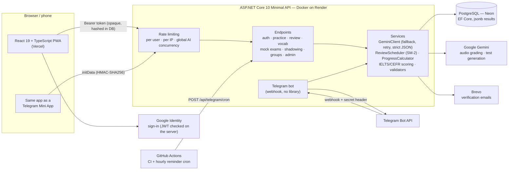

# AI Speaking Coach

🇬🇧 English · 🇺🇿 [O'zbekcha](README.uz.md)

[](https://github.com/ElshodDev/speaking-coach/actions/workflows/ci.yml)

An English-practice app for Uzbek- and Russian-speaking learners (A2–C1), with the interface in **Uzbek, Russian or English**. You **speak, write, read and listen**; an LLM (Google Gemini) grades your work against a rubric and points out concrete mistakes — and every mistake becomes a **spaced-repetition flashcard** that comes back right before you would forget it, including in a hands-free **commute mode** for earphones.

**Live app:** https://speaking-coach-theta.vercel.app · **[▶ Try the demo — no sign-up](https://speaking-coach-theta.vercel.app/#/demo)** (a private demo account with a history, flashcards and a streak already in place; deleted after 24 h)
(The backend runs on a free tier and sleeps after 15 minutes of inactivity — the first request may take 30–60 s.)

**How it was built and what went wrong along the way:** [case study](docs/case-study.md)

<p align="center"></p>

| Today's plan | Review card | Writing feedback | Dark mode |
|---|---|---|---|
|  |  |  |  |

| IELTS Reading mock | Full mock result | CEFR Listening (map) | Teacher results |
|---|---|---|---|
|  |  |  |  |

| Shadowing | Shadowing: AI check | Progress & levels | Vocabulary |
|---|---|---|---|
|  |  |  |  |

<sub>The interface is shown in Uzbek; it also switches to Russian and English. Screens are captured by the Playwright end-to-end tests against a mocked API.</sub>

## Features

| | |
|---|---|
| 🎙 **Speaking** | Record yourself on a topic. Gemini transcribes the audio **and** grades fluency, grammar and vocabulary in a single multimodal call. |
| ✍️ **Writing** | Write an essay; graded on an IELTS-style rubric (task achievement, coherence & cohesion, grammar, vocabulary) with exact corrections. |
| 📖 **Reading** | Gemini generates a fresh passage and 4 multiple-choice questions every time. Answers are checked by the server, not the LLM. |
| 🎧 **Listening** | Same, but the browser reads the script aloud (Web Speech API); the text is revealed only after you answer. |
| 🔁 **Spaced repetition** | Corrections and wrong answers automatically become flashcards scheduled with SM-2 (1 day → 3 days → ~1 week …). Daily goal and 🔥 streak. |
| 🚌 **Commute mode** | Hands-free review with earphones: question → thinking pause → answer. Keeps the screen awake with the Wake Lock API. |
| 📱 **Installable (PWA)** | Add to home screen; opens like a native app and loads offline. Bottom navigation on phones, dark mode follows the system. |
| 👆 **Tap a word** | In Reading passages, tap any unknown word: Gemini explains it in Uzbek *in the context of that sentence* (part of speech, meaning, English definition, example), and one tap saves it to your vocabulary. |
| 📚 **Vocabulary** | Your personal word list: search by English word or Uzbek meaning, filter by *New / Learning / Known* (derived from the review schedule), look up any word by typing it, and review only your words. Every word is also a spaced-repetition card — no separate table. |
| 🎚 **Learner level (A2–C1)** | Passage length, vocabulary and feedback adapt to the chosen level; grades stay on an absolute rubric so progress is comparable. |
| 📈 **Progress** | XP, levels and 10 badges; an 84-day activity calendar; score trends per criterion (with a table view); your hardest cards. |
| 🏆 **Weekly competition** | Opt-in leaderboard by weekly XP under a nickname — email and exercises are never shown. |
| 🎓 **Mock exams (IELTS)** | All four skills plus a **full exam** (Listening → Reading → Writing → Speaking, overall band = mean of the four with the official .25/.75 rounding). **Listening:** 4 parts, 40 questions, 30 s to read each part's questions, the recording is played **once** (browser TTS, two voices in conversations), 2 minutes to check. **Reading:** 3 passages, 40 questions (multiple choice, TRUE/FALSE/NOT GIVEN, YES/NO/NOT GIVEN, gap-fill with word limits), 60-minute timer, question map, draft survives a reload. Listening/Reading tests are generated by Gemini **once**, strictly validated (numbering, answer types, gap answers must appear in the text) and stored in a shared **test bank**, so each user gets one they haven't done and the AI quota is spent only when the bank runs out; correct answers never leave the server. Raw scores map to bands through the average points published on ielts.org (16→5, 23→6, 30→7, 35→8). **Speaking** (Part 1–3, ≈11 min) and **Writing** (60 min, Academic chart or GT letter + essay) are scored by Gemini on the four official criteria; the server computes the band. Everything is labelled as an estimate. |
| 🇺🇿 **Mock exams (CEFR Multilevel)** | Built on the **official documents of the Agency for Assessment of Knowledge and Skills**: the new Speaking format (from September 2024: 1.1 — 3 questions × 30 s; 1.2 — comparing pictures, question 4 45 s, 5–6 30 s; 2 — 3 questions and one picture, 1 min prep + 2 min; 3 — for/against argument, 1 + 2 min) and its **official rating scale** (questions 1–3: 0–5, 4–6: 0–5, 7: 0–5, 8: 0–6, with the descriptors passed to the examiner model); the new Writing format (from October 2025: 1.1 informal letter ≈50 words, 1.2 formal letter 120–150, Part 2 online discussion post 180–200; five criteria); and the Assessment criteria of 16 March 2023 (Writing Part 1 = 12, Part 2 = 24 points, **0–36 → 75 conversion table**, levels C1 65–75, B2 51–64, B1 38–50). **Listening** (6 parts, 35 questions, 45 min, every recording played twice — Part 1 each sentence twice in a row; reply choice, note completion, matching speakers, **map labelling** drawn as an SVG plan, three extracts, lecture) and **Reading** (5 parts, 35 questions, 60 min; gap-fill with a word found elsewhere in the text, matching texts and headings, multiple choice + TRUE/FALSE/NOT GIVEN, summary) follow Cabinet of Ministers Resolution No. 73 (16.02.2022) for question counts and timing; the tests are generated per part and strictly validated (numbering, two extra matching options, map cells, the Part 1 answer must appear elsewhere in the text as a whole word). Officially these sections are Rasch-scaled; we map the number of correct answers onto the document's own "approximate correct answers" table (C1 28–35, B2 18–27, B1 10–17), so the level matches it exactly. A **full CEFR exam** gives the overall score as the average of the four sections (official rule). Not published, and labelled as our assumption: converting Speaking 0–21 to 75 (linear), the exact score inside each Listening/Reading range, and the Writing time (60 min). |
| 🎬 **Shadowing** | Listen to one line and repeat it straight away. Two series: **Real English** — YouTube clips (in the youtube-nocookie player; every line plays from its own timestamp and stops) and **Everyday talks** — the app's own SVG characters (cat, owl, robot, fox, bear, penguin) speak in turns with the browser's voice and move their mouths. Lessons are numbered, and the list shows which ones you finished and your best score. The media stays pinned at the top on phones with **karaoke captions** (words light up as they are spoken — browser word boundaries or timestamps), and a pinned control bar: replay, previous/next, loop (off → 3× → ∞), 0.5×–1.5× speed. Modes: **normal**, **auto** (a pause to repeat after each line) and **hands-free** (line → you repeat, recorded automatically → your voice is played back → next line). Tap any word for its meaning and to save it; key words are highlighted; **translation** shows each line in Uzbek or Russian. **Check with AI** scores a recording, marks each word and gives one tip — or check all recorded lines at once (separate daily limit, recordings are not stored). Finishing gives XP, counts for the streak and suggests the **next lesson**; a Shadowing lesson is part of the daily plan. Six built-in character lessons (A2–B2, with translations); teachers and the admin add more in the bot: `/add` → Shadowing → a YouTube link with an optional range (`https://youtu.be/ID 1:20-3:40`, up to 5 min) — Gemini watches the clip and writes the timed lines with translations and key words — or a topic/text for the characters. |
| 🌟 **Word of the day and quick quiz** | A hand-picked list of 60 B1–C1 words that are common in IELTS and CEFR exams (translation in Uzbek and Russian, English definition, example) — one word a day, the same for everyone, no AI cost; listen to it and add it to your vocabulary in one tap (also `/word` in the Telegram bot). The **quick quiz** asks 10 questions from your own vocabulary (word → meaning and meaning → word in turn, four options, the right answer shown after each), topped up with daily words while the vocabulary is small; the best score is kept on the device, and the result can be sent to a friend through Telegram or the phone's share sheet. |
| 🧭 **Onboarding and today's plan** | On first login the app asks four quick questions — goal (IELTS, CEFR or general English), level (with a "not sure → B1" option), target score and exam date (skipped for general English), and minutes per day — and can be skipped or changed later from the profile. The home screen then shows **Today's plan**: review up to the daily goal, a skill of the day that rotates every day (a second one for 30+ minutes), and for exam takers one mock section — weekly, or every day when the exam is within 14 days, picking the section never taken or taken longest ago. Items tick themselves off from what the server sees today (the user's time zone), with a countdown to the exam. |
| 👩‍🏫 **Teacher groups** | Any user can open the teacher panel from their profile, create a group and share an invite link or 6-character code (no ambiguous characters such as 0/O, 1/I/L; a new code invalidates the old link). Assignments: a practice type, a mock module, or "review N cards", with an optional deadline and instructions. **No separate submission step** — an assignment counts as done by the student's first matching attempt after it was set (late if after the deadline; review progress shown as 12/20). The teacher sees a results matrix and can open the matched attempt, but only the student's nickname (or the part of the email before @) and only attempts that match the group's assignments — the student is told this before joining, and can leave at any time. Students see a "My tasks" page and a card on the home screen. Limits: 20 groups per teacher, 200 students per group. |
| 🛠 **Admin panel** | For the owner only (`Admin:Emails`): signups, daily/weekly/monthly active users, exercises by type, reviews — aggregates and masked emails only. A **System status** card checks the database schema against the code (pending migrations, missing tables), the Telegram webhook (URL, pending updates, last error) and which optional features are on — without ever returning a secret. |
| 📲 **Telegram bot** | [@SpeakingCoachUzBot](https://t.me/SpeakingCoachUzBot): connect from Profile with one tap, then review due cards right in the chat, send any English word to get a translation and add it to your vocabulary, check your streak, open **📋 Today** (the same daily plan as the website, the exam countdown and pending teacher assignments, with buttons that open each task), and get **one** daily reminder at the hour you choose — it also mentions pending and overdue assignments and the days left to the exam, and is skipped only when today's goal is done and nothing is pending. When a teacher sets an assignment, connected students get a message with a **▶️ Do it** button. **Teachers and the admin can add mock tests** with `/add`: pick IELTS or CEFR and a section, then send material (text, a PDF or a photo — existing questions and answers are kept, gaps are filled, Listening takes a script) or just a topic for Gemini to write an original test; the result passes the same strict validators and comes back as a draft with the full text and answers as a `.txt` file. The admin publishes directly; a teacher sends it for review and the admin approves or rejects (the author is notified). Published tests join the mock-exam bank; `/bank` shows counts and the review queue. Same database as the website, in Uzbek, Russian or English — pick it with `/lang`; `/guide` explains every section of the website with a button for each, and those buttons open the site **inside Telegram as a Mini App**, signing linked users in without a password (the Telegram-signed `initData` is verified with HMAC-SHA256 on the server) (works before linking too, and the welcome message offers the choice). |
| 🌐 **Three languages** | The whole interface, server error messages and word translations switch between Uzbek (official Latin orthography), Russian and English. Detected from the browser, switchable in the header and in Profile. |
| 👀 **Demo account** | One tap (or the [`#/demo`](https://speaking-coach-theta.vercel.app/#/demo) link) opens a private, temporary account that already has a week of history: three speaking and two writing attempts with feedback, a reading and a listening result, a finished shadowing lesson, saved words, flashcards (some due now), a 6-day streak and a half-done daily plan. It behaves like a real account with guest-level AI limits, can't receive email, link Telegram or join the leaderboard, is left out of admin statistics, and is deleted with all its data after 24 hours. |
| 🔐 **Accounts** | Register / log in; your history and cards are private. The email is **verified with a 6-digit code** (so only real, owned addresses get accounts), and a forgotten password is reset with the same code. **Sign in with Google** is available too. Everything also works as a guest (nothing is saved). |

## Architecture



**One request, end to end (speaking):** the browser records audio → `POST /api/speaking/submit` → rate limiter (per user, per IP, server-wide AI slots) → daily AI quota check → one multimodal Gemini call returns transcript + scores → the JSON is parsed strictly and range-checked → the attempt is saved to `Activities` and every correction becomes a spaced-repetition card in the same transaction → the quota is charged only after success.

## Engineering decisions

Each of these is explained in more depth (in Uzbek) in [README.uz.md](README.uz.md) and in code comments.

- **One Gemini call for speaking.** Gemini accepts audio directly, so there is no separate speech-to-text step — a simpler architecture and one API call instead of two.
- **LLM output is never trusted blindly.** Replies are parsed with `RespectRequiredConstructorParameters` and `RespectNullableAnnotations`, then range-checked. The default `System.Text.Json` behaviour silently turned a missing `"score"` into `0` and saved it — a real bug this project hit and fixed.
- **The LLM generates, code grades.** For Reading/Listening the answer key is known, so grading is deterministic C#. The key is kept server-side (`PendingExercises`) and never sent to the browser.
- **Measuring LLM grading stability.** A built-in "stability test" re-grades the same input 5× (`?save=false`, sequential to respect rate limits) and shows min/max/spread per criterion — the honest answer to "how reliable is an AI grader?".
- **Email ownership is proven, not assumed.** A format check can't tell whether an address exists, so sign-up sends a 6-digit code (stored as a SHA-256 hash, 15-minute lifetime, 5 attempts, 60 s cooldown, 5 emails/hour, constant-time comparison). Unverified accounts can't log in, and re-registering an unverified address re-sends the code to its real owner; the password is stored only when the code is confirmed, so a stranger who registered first can't keep a password on someone else's email. Code attempts are reserved with an atomic `UPDATE … WHERE Attempts < 5`, so parallel guesses can't exceed the limit. Emails go through Brevo's HTTPS API because Render's free tier blocks outbound SMTP ports (25/465/587) since September 2025. Verification switches on only when a Brevo key is configured, so deploying the code never locks anyone out.
- **Google sign-in without an auth library.** The browser gets a Google-signed ID token; the server verifies it itself (RS256 signature against Google's JWKS, `iss`, `aud` = our client ID, expiry, `email_verified`) using .NET's built-in RSA. Signing in with Google to an account whose email was never verified wipes the old password, since a stranger could have set it.
- **A Telegram bot on a free, sleeping server.** The bot uses a webhook (Telegram wakes the Render instance), verified with the `X-Telegram-Bot-Api-Secret-Token` header. A sleeping server can't run timers, so a GitHub Actions cron pings `/api/telegram/cron` hourly and the server sends whatever reminders are due — logic is "the hour has passed and none was sent today", so a delayed cron still works and nobody gets two messages. Linking uses a one-time `t.me/…?start=TOKEN` link (hashed, 15 min). No bot library: five Bot API calls over `HttpClient`, with the pure parts (callback encoding, reminder timing, menu parsing, Telegram JSON) unit-tested.
- **Daily AI quota per user.** Gemini's free quota is shared by everyone, so each account gets a daily budget (30 exercises, 100 word look-ups; guests 5/20 per IP, configurable via `Ai:*`). It is checked *before* calling Gemini and charged only *after* a successful answer, so a Gemini outage never eats a user's quota; the remaining budget is shown in the UI. Review and vocabulary never touch the AI and stay unlimited.
- **Your data, your control.** Profile → *Your data* downloads everything as JSON and deletes the account on the spot (confirmed by retyping the email); all rows cascade from the user. Speaking audio is only sent to the grader and never written to disk.
- **Opaque session tokens instead of JWT.** 32 random bytes, stored only as a SHA-256 hash. Logging out revokes the token immediately — impossible with a plain JWT. Passwords use ASP.NET Core's `PasswordHasher` (PBKDF2).
- **Pure core logic.** `ReviewScheduler`, `ReviewCardFactory`, grading and parsing don't touch the database or HTTP, which is what makes them unit-testable.
- **Streaks use the user's local day**, not UTC — a review at 01:00 in Tashkent must not count as "yesterday".
- **Type-safe i18n without a library.** Each screen declares its texts once in Uzbek (`defineMessages(uz, { ru, en })`); the Russian and English objects must have the same shape, so a missing translation fails the TypeScript build. Plurals are plain functions (`ruPlural(n, 'слово', 'слова', 'слов')`). The server localizes its messages from the standard `Accept-Language` header; services return message keys, not text.
- **XP is derived, not stored.** Levels, badges and the weekly leaderboard are computed from `Activities` and `ReviewLogs` by a pure `ProgressCalculator`. There is no XP counter to drift out of sync, and changing the rules re-scores history automatically.
- **A demo that can't be abused.** Every click creates a *separate* account (visitors never see each other's data) seeded by a pure, unit-tested `DemoSeed` that builds results with the same records and card factory as the real endpoints, so every screen renders them normally. Its address is on the reserved `.invalid` domain (RFC 2606), so no email can ever be sent; there is no password; AI use is capped at guest level; creation is limited per IP and per day; and an hourly job deletes demo accounts older than 24 hours through the database's cascading foreign keys.
- **Privacy by default.** The leaderboard is opt-in and shows only a nickname; the admin panel shows aggregates and masked emails (`az***@mail.com`), never anyone's essays or cards.
- **Charts without a chart library.** Small hand-built SVG charts with a colour-blind-checked palette, tooltips, keyboard navigation and a table view for accessibility.
- **One `Activities` table with `jsonb` payloads** for all exercise types, so adding a new type needs no new table.
- **No UI framework.** A small design system of CSS variables (`src/styles.css`) gives consistent components and dark mode for free; routes are hash-based (`#/review`) so the phone's Back button works.

## Quality

- **Tests:** 525 backend unit tests (xUnit) — scheduler, streak across time zones, card creation, grading, strict parsing, token hashing, XP/levels/badges, leaderboard ranking, level-aware prompts, vocabulary status, localized messages (every key in all three languages with matching placeholders), email-code rules (expiry, attempts, cooldown, hourly cap), email templates Google ID-token validation (forged signature, wrong audience/issuer, expiry, `alg: none`), AI quota, the Telegram bot logic (including the Today message, reminder lines and new-assignment messages), the system-status rules and IELTS band maths (official rounding, Task 2 weighting, word count, mock limits, question-bank format, objective grading and word limits, raw-score→band anchors, the test validator, answer-free client payloads, full-mock rounding, the official CEFR raw→75 table, row by row, CEFR Listening/Reading format checks and the correct-answers→level table, the daily plan (rotation, mock cadence, onboarding validation), the word list and quiz builder, teacher groups: join codes, assignment types, completion/lateness rules, score labels, what the teacher can see, bot test authoring: review rules, callbacks, accepted files, validators and the review text, shadowing: YouTube link/range parsing, timestamp shifting, lesson validation, aligning the AI pronunciation result, security rules: email-code precheck/match, admin-ID parsing, rate-limit keys, the test-generation gate, double-click grading, join-code randomness, demo data: streak across time zones, result shapes, limits) — and 118 frontend tests with Vitest (charts, word tapping, vocabulary search, plurals).
- **CI:** GitHub Actions builds and tests the backend and type-checks, tests and builds the frontend on every push, and fails on known vulnerable packages (`dotnet list package --vulnerable --include-transitive`, `npm audit --audit-level=high`). **Dependabot** opens grouped update PRs weekly (npm, NuGet) and monthly (GitHub Actions).
- **Rate limiting:** 10 req/min per IP on login/register; Gemini-backed endpoints get 30 req/min per signed-in user (or per IP for guests), at most 2 concurrent AI requests per user, 8 per IP and 16 for the whole server (the rest wait in a short queue), so a class behind one Wi-Fi still works but nobody can flood the AI. Test generation also allows one run at a time per user and counts failed attempts. The real client IP is read from `X-Forwarded-For` behind Render's proxy (last hop only).
- **Hardening:** the Gemini key travels in the `x-goog-api-key` header (never in a URL that could reach logs); large AI payloads are serialized once and limited to two in flight; the Telegram Mini App auto-login only runs inside a real Telegram client with `initData` no older than 1 hour (no login-CSRF via a crafted link); bot admins are matched by numeric Telegram ID only (usernames can change hands); the Docker image runs as a non-root user; the site sends `nosniff`, a strict referrer policy, a microphone-only permissions policy and `frame-ancestors` limited to Telegram; group join codes come from a CSPRNG; expired sessions and codes are purged hourly; the database connection retries transient Neon errors.
- **Resilience in the browser:** a page crash or a missing lazy chunk after a new deploy shows a "Reload" card (with one automatic reload) instead of a white screen; a slow cold start no longer signs the user out (only a real 401 does); the microphone is released when you leave a page.
- **Health check:** `GET /health` reports API and database status (503 if the DB is unreachable).

## Tech stack (all on free tiers)

| Part | Technology |
|---|---|
| Frontend | React 18, TypeScript, Vite 8, Vitest 5, CSS variables (no UI framework), PWA — Vercel |
| Backend | ASP.NET Core 10 Minimal API, EF Core, Docker — Render |
| Database | PostgreSQL — Neon |
| AI | Google Gemini (AI Studio key, no credit card) |
| Speech | Browser Web Speech API |
| CI | GitHub Actions |

## Run locally

Prerequisites: .NET 10 SDK, Node 22, a [Gemini API key](https://aistudio.google.com/apikey), a [Neon](https://neon.tech) Postgres database.

```bash
# backend
cd backend/SpeakingCoach.Api
dotnet user-secrets init
dotnet user-secrets set "Gemini:ApiKey" "<your key>"
dotnet user-secrets set "ConnectionStrings:Default" "Host=...;Database=...;Username=...;Password=...;SSL Mode=Require"
dotnet user-secrets set "Admin:Emails" "you@example.com"   # optional: who sees the admin panel
dotnet tool update --global dotnet-ef
dotnet ef database update
dotnet run                      # http://localhost:5000

# frontend (second terminal)
cd frontend/speaking-coach-web
npm ci
npm run dev                     # http://localhost:5173
```

Tests:

```bash
dotnet test backend/SpeakingCoach.Api.Tests
cd frontend/speaking-coach-web && npm test
```

## Deploy

- **Render** (backend): root directory `backend/SpeakingCoach.Api`, Docker; env vars `Gemini__ApiKey`, `ConnectionStrings__Default`, `FrontendOrigin` (the Vercel URL, for CORS), optionally `Admin__Emails` (comma-separated) and, to turn on email verification, `Email__BrevoApiKey` + `Email__FromAddress` (a sender verified in [Brevo](https://www.brevo.com); free plan: 300 emails/day), and `Google__ClientId` for Google sign-in (a Web OAuth client with the Vercel URL as an authorized JavaScript origin), and `Telegram__BotToken` + `Telegram__CronSecret` for the bot (optionally `Telegram__Admins` — comma-separated numeric Telegram IDs that may publish and approve tests in the bot; send `/id` to the bot to see yours) (plus GitHub secrets `API_URL` and `CRON_SECRET` for the reminder workflow).
- **Vercel** (frontend): root directory `frontend/speaking-coach-web`; env var `VITE_API_URL` (the Render URL).
- **Migrations** are applied with `dotnet ef database update` before pushing code that depends on them (Render does not run them).

## Known limitations

- Free tiers: Gemini rate limits; the backend sleeps when idle.
- No push reminders yet; commute mode needs the screen on (some phones stop audio when it turns off).
- The token lives in `localStorage` (cross-site cookies between `vercel.app` and `onrender.com` are increasingly blocked); an XSS bug could expose it.
- Verification emails from a free-mail sender address (e.g. Gmail) may land in Spam; authenticating your own domain in Brevo fixes that.
- Automated tests cover pure logic; database/endpoint integration tests are next.

## Roadmap

- [x] One-click demo account with seeded data
- [x] Telegram bot, teacher groups, IELTS/CEFR mock exams, shadowing
- [ ] Daily reminder via Web Push ("12 cards are waiting")
- [ ] Integration tests with `WebApplicationFactory` + Testcontainers Postgres
- [x] Progress page, XP/levels/badges, weekly leaderboard, admin panel
- [x] Learner level (A2–C1), tap-a-word and a personal vocabulary
- [x] Interface in Uzbek, Russian and English
- [x] Email verification and password reset
