# AI Speaking Coach

🇬🇧 English · 🇺🇿 [O'zbekcha](README.uz.md)

An English-practice app for Uzbek- and Russian-speaking learners (A2–C1) preparing for IELTS, the national CEFR Multilevel exam or everyday English. You **speak, write, read and listen**; an AI (Google Gemini) grades each attempt against a rubric and names concrete mistakes, and **every mistake becomes a flashcard** that comes back just before you would forget it. The learning material itself is **built into the app** — exercises, full mock tests, topics, grammar lessons and topic vocabulary — and AI writes new material only when the learner asks for it. The interface works in Uzbek, Russian and English, on a phone, a laptop or inside Telegram.

**[Open the app](https://speaking-coach-theta.vercel.app)** · **[▶ Try the demo — no sign-up](https://speaking-coach-theta.vercel.app/#/demo)** · **[Case study: how it was built](docs/case-study.md)**

The demo opens a private account with a week of history, flashcards and a streak already in place; it is deleted after 24 hours. The server runs on a free tier and sleeps when idle, so the first request can take 30–60 s.

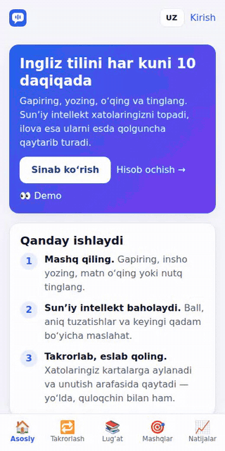

### On a laptop

The whole screen is used: a sidebar menu, two-column pages, and in mock exams the passage and the questions side by side, as in the computer-delivered IELTS.

| Home | IELTS Reading: passage and questions side by side |
|---|---|
| 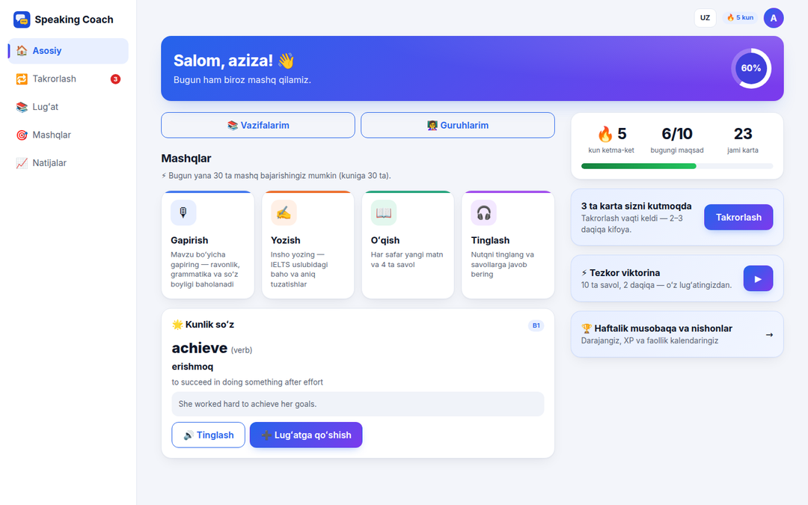 | 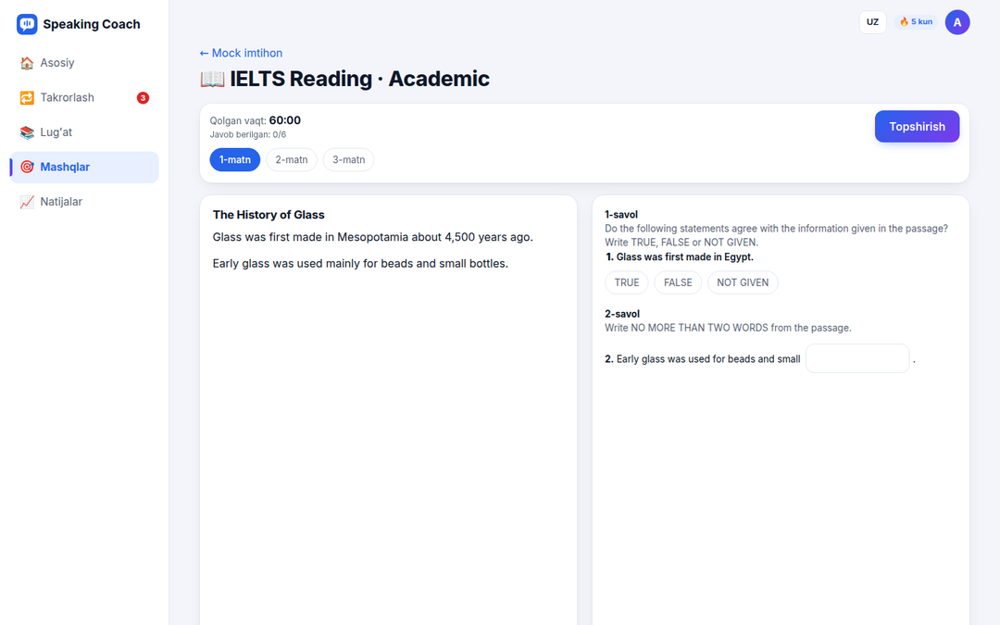 |
| **IELTS Writing: task and answer side by side** | **Shadowing: characters on the left, lines on the right** |
| 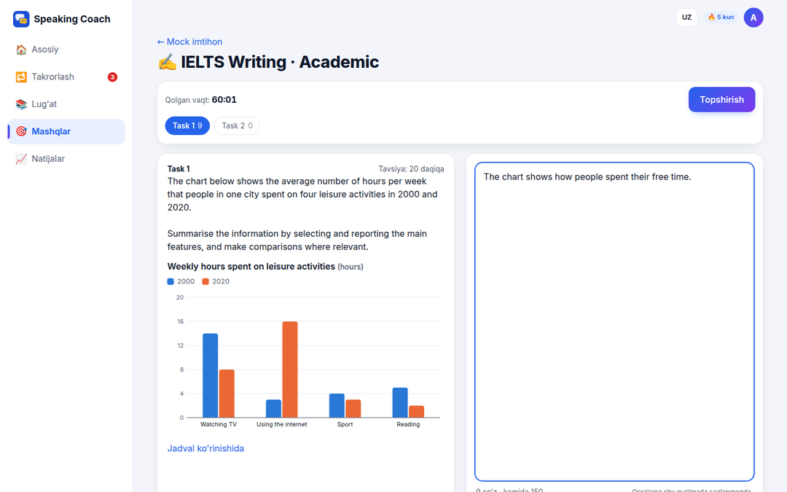 | 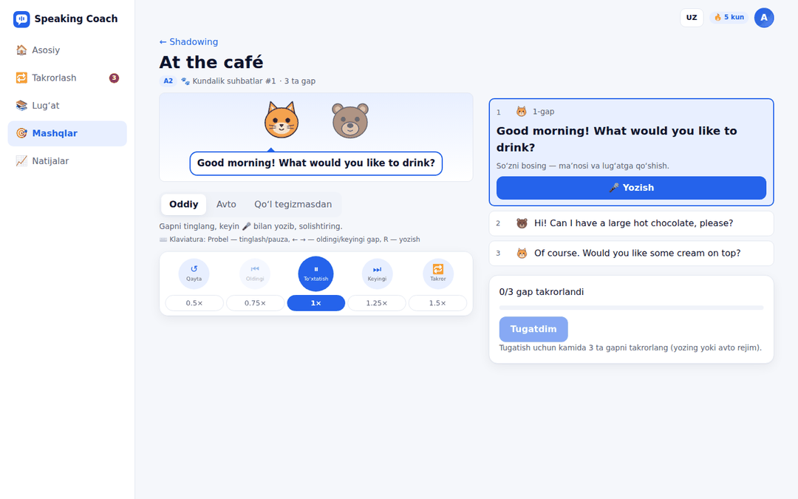 |

### On a phone

| Today's plan | Review card | Writing feedback | Dark mode |
|---|---|---|---|
| 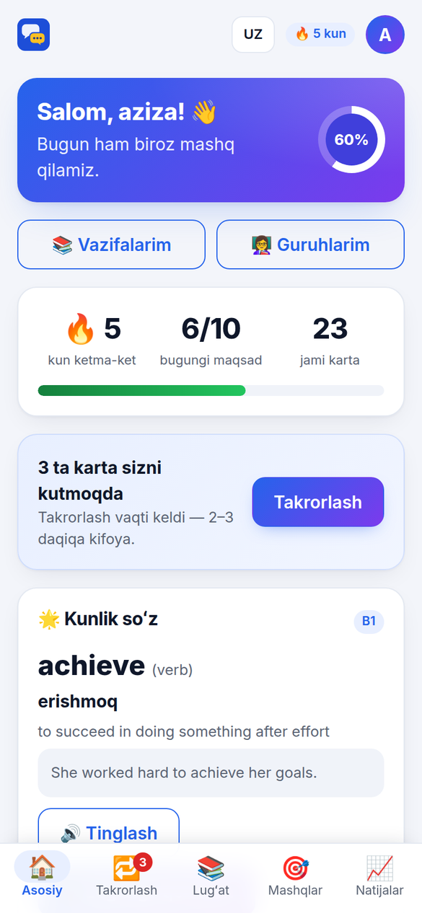 | 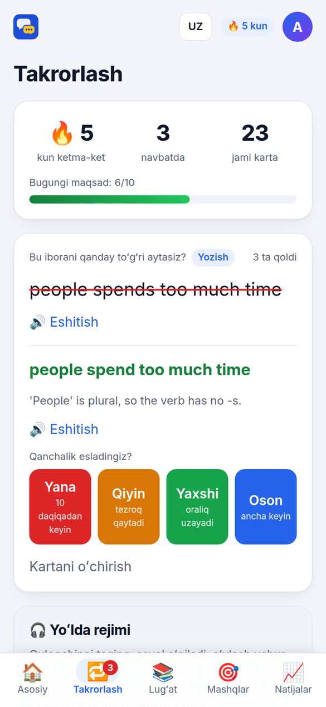 | 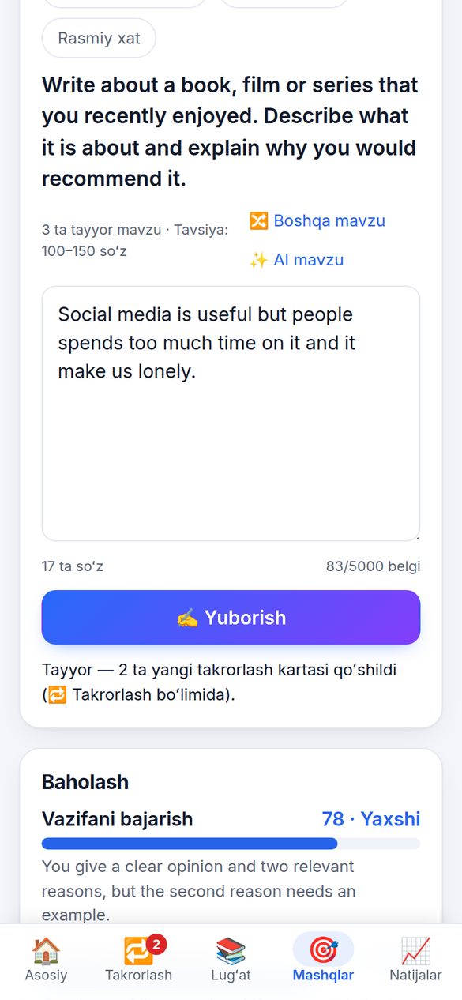 | 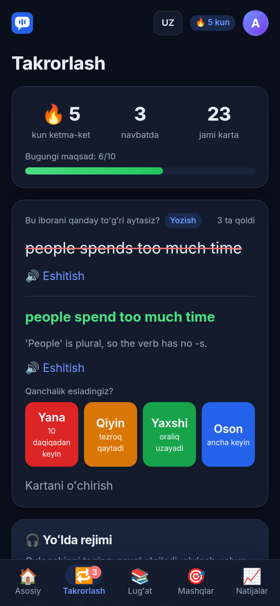 |

| IELTS Reading mock | Full mock result | CEFR Listening (map) | Teacher results |
|---|---|---|---|
| 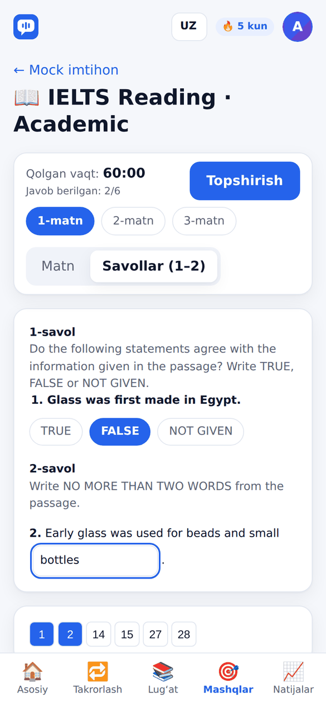 | 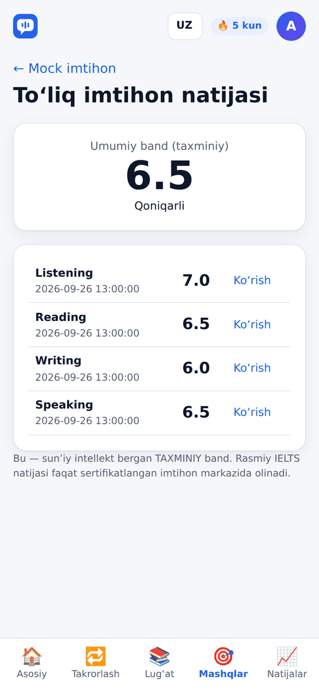 | 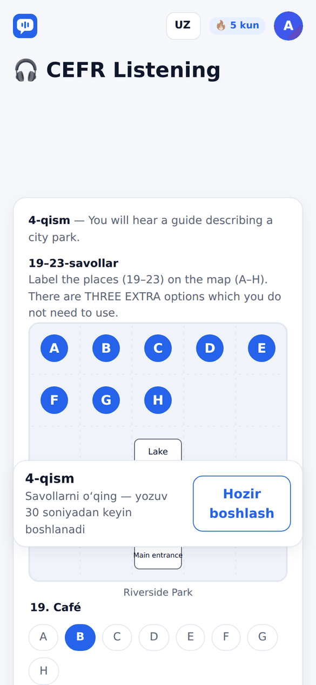 | 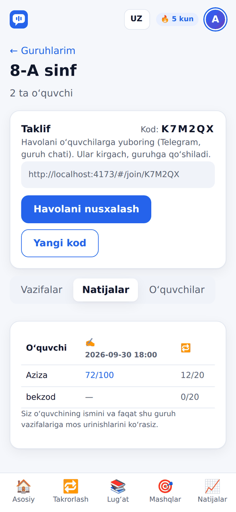 |

| Shadowing | Shadowing: AI check | Progress & levels | Vocabulary |
|---|---|---|---|
| 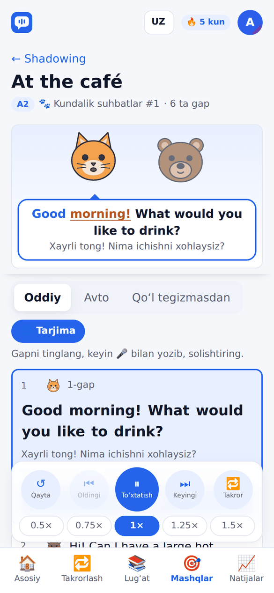 | 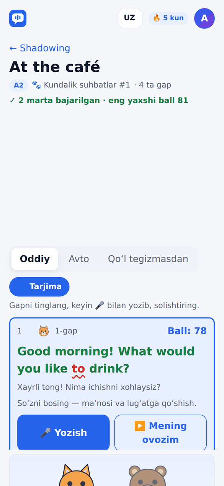 | 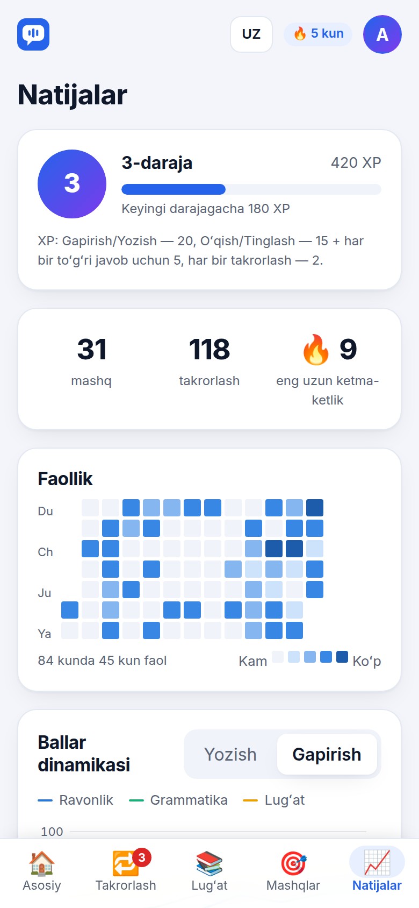 | 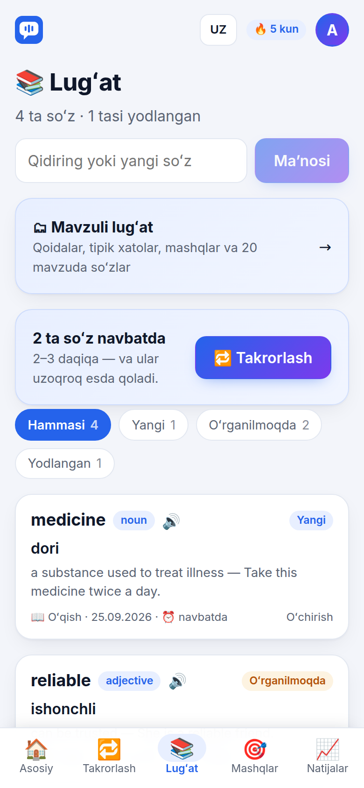 |

Screens are shown in Uzbek. They are captured by the Playwright end-to-end tests against a mocked API, so they always match the current UI.

## What it does

| | |
|---|---|
| 🎙 **Speaking** | Record an answer to a topic. One multimodal Gemini call transcribes the audio and grades fluency, grammar and vocabulary. |
| ✍️ **Writing** | Write an essay; it is graded on an IELTS-style rubric (task, coherence, grammar, vocabulary) with exact corrections. |
| 📖 🎧 **Reading & Listening** | A passage (or a script read aloud by the browser) with four questions. The learner chooses: **📚 a ready-made exercise** from the app's library (88 original texts, 11 per level for each skill, unlimited; pick one from the list or take the next unread one) or **✨ a new one written by AI** (daily limit). The server grades the answers; the key never reaches the browser. Tap any word in a passage for its meaning in context. |
| 🔁 **Spaced repetition** | Corrections and wrong answers become flashcards scheduled with SM-2, with a daily goal, a streak and a hands-free **commute mode** for earphones. |
| 📚 **Vocabulary** | Saved words with search, *New / Learning / Known* filters and a quick quiz. A new word of the day, the same for everyone. |
| 🎓 **Mock exams** | **IELTS**: Listening, Reading, Writing, Speaking and a full exam with the official band rounding. **CEFR Multilevel**: all four sections following the official format and scoring tables. The app ships with 44 full original Listening and Reading tests (11 for each IELTS and CEFR section) and 60 Speaking/Writing sets. Every section opens with a list of its tests that shows which ones the learner has done and the last score; they pick one, start the next unfinished one, or let AI write a new test, which is strictly validated and added to the shared bank. Speaking and Writing are scored by AI on the official criteria. Every score is labelled as an estimate. |
| 🎬 **Shadowing** | Hear a line, repeat it straight away. Two series: YouTube clips with karaoke captions, and dialogues voiced by the app's own animated characters. Normal, auto and hands-free modes, speed and loop controls, translations, and an optional AI pronunciation check. |
| 🗣 **AI conversation partner** | A spoken role-play in 12 situations (café, hotel, job interview, doctor, IELTS Part 1 and Part 3 examiner, debate…). The learner answers by voice or by typing; one Gemini call per turn hears the answer, replies in character and gently corrects the single most useful mistake. The history lives on the server, turns are capped, and the finished conversation ends with feedback, useful phrases and new flashcards. |
| 🎧 **Dictation** | Listen and type: 60 original sentences across A2–C1, read aloud by the browser at normal or slow speed. Every word is checked in the browser (correct, wrong, missing, extra), with no AI and no limit. |
| 📘 **Lessons** | 32 grammar lessons (A2–C1) with rules, examples, the typical mistakes of Uzbek and Russian speakers and a 6-question practice, explained in Uzbek, Russian and English; AI can add 6 more questions on request. 20 topic vocabulary sets (326 words with translations, definitions, examples and audio) with a quick self-test and one-tap "add to my vocabulary". |
| 🗂 **Topics** | 92 ready-made Speaking and Writing topics by level and type (everyday, IELTS Part 1–3, CEFR, paragraphs, essays, letters) with suggested word counts; **✨ AI topic** suggests a new one. |
| 🧭 **Daily plan** | A short onboarding (goal, level, target score, exam date, minutes per day) turns into a plan for each day that ticks itself off, with an exam countdown. |
| 👩‍🏫 **Teacher groups** | A teacher shares a join code, sets assignments (practice, mock sections, "review N cards") with deadlines, and sees a results matrix. Assignments count as done automatically, with no separate submission. |
| 📈 **Progress** | XP, levels, badges, an activity calendar, score trends and an opt-in weekly leaderboard under a nickname.. **My mistakes** groups every AI correction from speaking, writing, mock exams and conversations into types (articles, tenses, prepositions, agreement…), shows whether each is growing or shrinking over the last 30 days and links to the matching grammar lesson. **Share card** draws a 1080×1920 story image of your level, streak and exercises in the browser. |
| 📲 **Telegram bot** | [@SpeakingCoachUzBot](https://t.me/SpeakingCoachUzBot): review cards in the chat, look up and save words, get one daily reminder, see today's plan and assignments. The website opens inside Telegram as a Mini App and signs the user in automatically (a new account is created on the first visit). Teachers can turn a PDF, a photo or a topic into a validated mock test that the admin approves. |
| 👀 **Demo account** | One click opens a private, temporary account full of realistic data, so anyone can see every screen without registering. |
| 🔐 **Accounts** | Sign in with Telegram (send the bot the number shown on the site), with a 6-digit email code, with Google, or with a password; no password is needed, and the account is created on first sign-in. Inside in-app browsers (Instagram, Telegram), where Google blocks its sign-in window, the app explains this and points to Telegram sign-in. The profile lists the sign-in methods and lets a Telegram account add an email and password. Everything also works as a guest; nothing is saved then. Export or delete your data from the profile, read the terms and privacy policy, or send feedback from any page. |
| 🌐 **Three languages** | The interface, server messages and word translations switch between Uzbek, Russian and English. |

## How it is built

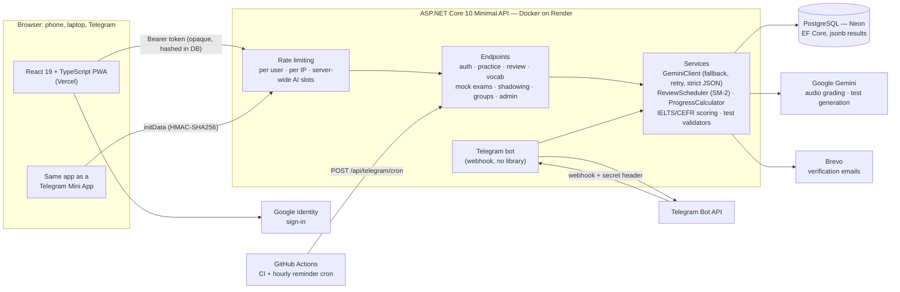

**One request, end to end (speaking).** The browser records audio → `POST /api/speaking/submit` → rate limiter → daily AI quota check → one Gemini call returns the transcript and scores → the JSON is parsed strictly and range-checked → the attempt is saved to `Activities`, and every correction becomes a flashcard in the same transaction → the quota is charged only after success.

| Layer | Technology |
|---|---|
| Frontend | React 19, TypeScript, Vite, Vitest; a small design system of CSS variables (no UI framework); PWA; hash routing; Vercel |
| Backend | ASP.NET Core 10 Minimal API, EF Core + Npgsql, built-in rate limiter; Docker on Render |
| Database | PostgreSQL on Neon; one `Activities` table with `jsonb` results for every exercise type |
| AI | Google Gemini (audio and text in, strict JSON out), with a fallback model |
| Speech | Browser Web Speech API for listening scripts and characters' voices |
| Messaging | Telegram Bot API (webhook), Brevo HTTPS API for email |
| CI | GitHub Actions: build, tests, vulnerable-package check; Dependabot |

Everything runs on free tiers.

## Engineering decisions

- **One Gemini call for speaking.** Gemini accepts audio directly, so there is no separate speech-to-text service: half the API calls and one less thing to break.
- **Model output is untrusted input.** Replies are parsed with `RespectRequiredConstructorParameters` and `RespectNullableAnnotations`, then range-checked. By default, `System.Text.Json` turned a missing `score` into `0` and saved it; this project hit that bug and fixed it at the root.
- **Content first, AI on request.** Everything a learner needs to practise is part of the app, so it works instantly, costs nothing and keeps working when the AI quota runs out. Wherever material can come from either place, the learner picks: "📚 ready-made" or "✨ new by AI". Built-in content goes through the same strict validators as AI output (word counts per level, question formats, answers present in the text), enforced by unit tests.
- **The model writes the test, code grades it.** Wherever an answer key exists, grading is deterministic C#. Mock tests are generated once, checked by strict validators (numbering, answer types, gap answers must appear in the text, map options) and reused from a shared bank, so AI quota is spent only when the bank runs out.
- **Measured grading stability.** A built-in admin tool re-grades the same recording or essay five times and shows the spread per criterion, which makes the AI grader's uncertainty visible.
- **Designed for a sleeping server.** The bot uses a webhook, so a message wakes the API. Reminders come from an hourly GitHub Actions cron. Each account is claimed atomically before its message is sent, so a delayed or repeated cron run never sends a duplicate.
- **Pure core logic.** The SM-2 scheduler, IELTS band rounding, the CEFR score tables, XP and badges, reminder timing and the demo seed never touch the database or HTTP. That is why 759 tests run in seconds.
- **XP is derived, not stored.** Levels, badges and the leaderboard are computed from the history, so nothing drifts out of sync and rule changes re-score the past automatically.
- **Type-safe translations without a library.** Each screen declares its texts once in Uzbek, and the Russian and English versions must have the same shape, so a missing translation fails the build.
- **One layout, three screen sizes.** Phone first, with bottom navigation. On a tablet the menu moves to the top. On a laptop the app switches to a sidebar with two-column pages and split-screen exams, and keyboard shortcuts appear: Space to reveal or play, 1–4 to grade, ← → to move between lines, R to record.

## Security and reliability

- **Accounts.** Email ownership is proven with a 6-digit code (hashed, 15 minutes, 5 attempts reserved atomically in the database, cooldowns). An unverified account gets its password only when the code is confirmed, so nobody can pre-register someone else's email. Passwordless sign-in uses the same codes: the first confirmed code proves ownership, and any password or session set on the unverified account before that is wiped, as with Google. Google ID tokens are verified on the server against Google's keys. Sessions are opaque random tokens stored as SHA-256 hashes, so logging out revokes them immediately; an active session renews itself, so regular users are never logged out after 30 days. Telegram sign-in on the website uses a one-time deep link plus number matching: the site shows a two-digit number that the user types into the bot, and a wrong number or "This isn't me" cancels the attempt; the bot warns that anyone who sends you a link and tells you the number is a scammer. The session is issued once, to the browser that holds the poll token. Emails are capped per day so a flood of code requests can't exhaust the mail quota.
- **Abuse limits.** Separate per-IP limits for sign-in, for email-sending endpoints and for polling, and a per-user limit on ordinary writes. For AI endpoints: 30 requests a minute per user, at most 2 at once per user, 8 per IP and 16 server-wide. A daily AI budget per account (lower for guests and demo accounts, reset at Tashkent midnight) is charged only after a successful answer; AI conversation turns and bot test authoring have their own caps. Replayed results don't earn extra XP. Uploads are size-checked before they are read into memory.
- **Telegram.** The webhook is checked with a secret header. Mini App sign-in verifies Telegram's HMAC signature, accepts it only inside a real Telegram client and only if it is less than an hour old. Bot admins are matched by numeric ID only, never by username.
- **Secrets and data.** The Gemini key travels in a header, never in a URL. Speaking audio is never written to disk. The Docker image runs as a non-root user. The site sends `nosniff`, a strict referrer policy, a microphone-only permissions policy and `frame-ancestors` limited to Telegram. The leaderboard is opt-in, and the admin panel shows aggregates and masked emails only.
- **Resilience.** A server-wide Gemini budget and a circuit breaker stop the app from burning a shared quota: when the model is overloaded the user gets a clear "AI is busy, try again in N seconds" (503 with `Retry-After`) instead of a long wait. Transient database errors are retried. Expired sessions, codes, demo accounts, stale drafts and never-used accounts are purged automatically. In the browser, requests time out with a translated message, a "server is waking up" banner appears during a cold start, the signed-in state is restored before the server answers, essay drafts are saved locally, and a crash or a missing chunk after a deploy shows a "Reload" card instead of a white screen.

## Quality

- **759 backend unit tests** (xUnit) cover scheduling, scoring tables, validators, strict parsing, the security rules, bot logic, localisation (every message in all three languages with matching placeholders), the demo seed and every piece of built-in content (mock tests, exercises).
- **170 frontend unit tests** (Vitest) cover charts, text handling, shadowing and dictation logic, network errors and timeouts, the Telegram launch check and sign-in state, in-app browser detection, Uzbek spelling in every translation, and the built-in lessons, vocabulary and topics (including an even spread of correct answer letters).
- **28 Playwright end-to-end suites** drive the real frontend against a mocked API on phone, tablet and laptop screens. The screenshots above come from these runs.
- **CI** builds and tests both halves on every push and fails on known vulnerable packages.

## Known limitations and next steps

- The database and endpoint layer has no integration tests yet. The next step is `WebApplicationFactory` with a real Postgres in Testcontainers.
- Free tiers mean a 30–60 s cold start and a shared Gemini quota.
- The session token lives in `localStorage` because the site and the API are on different domains. A custom domain would allow an `httpOnly` cookie and authenticated email sending.
- Scores are estimates. Official IELTS and CEFR results come only from certified exam centres.

The full story, including what went wrong and how it was fixed, is in the **[case study](docs/case-study.md)**.
