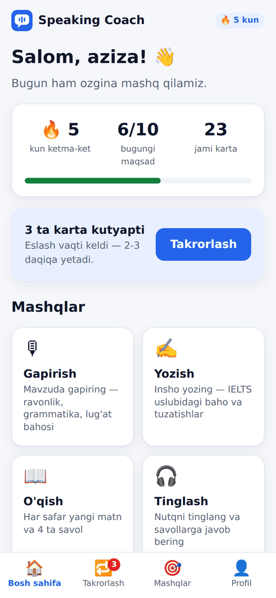
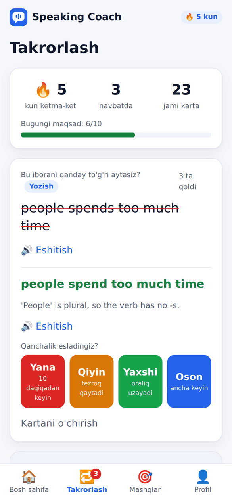
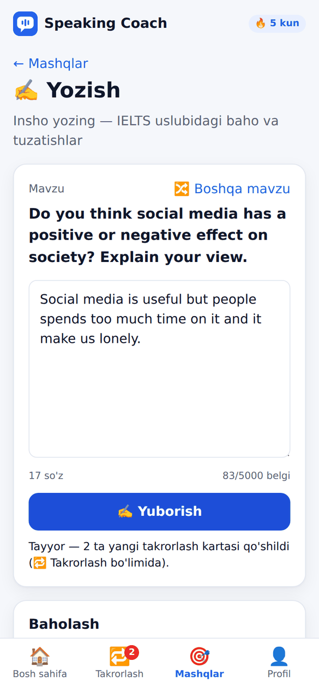
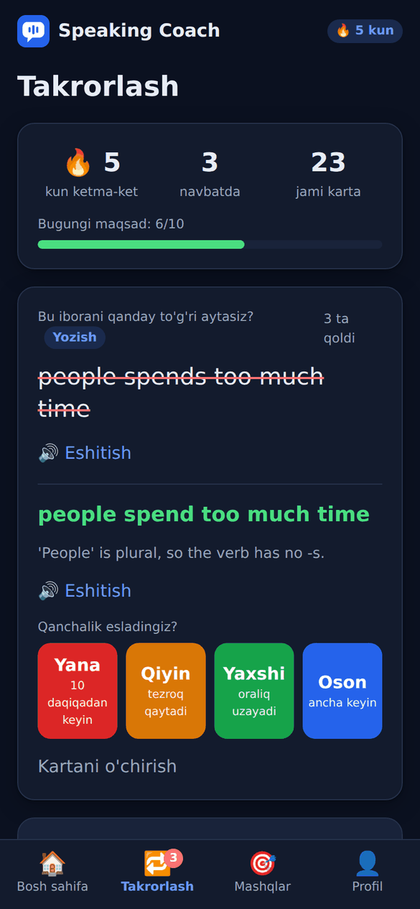
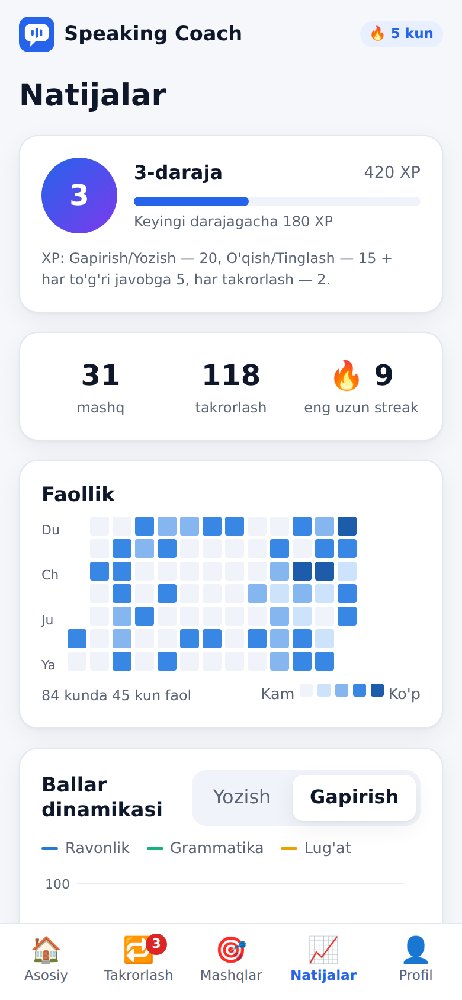
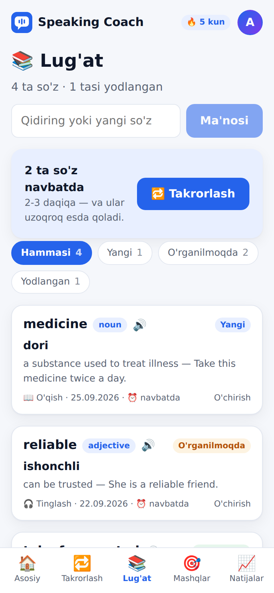
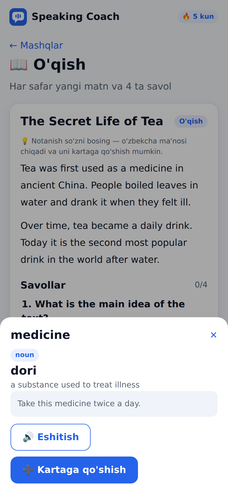
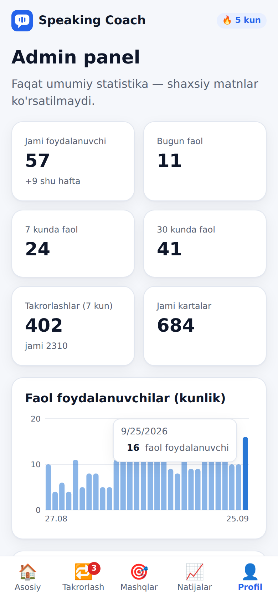

# AI Speaking Coach

🇬🇧 [English](README.md) · 🇺🇿 O'zbekcha

[](https://github.com/ElshodDev/speaking-coach/actions/workflows/ci.yml)

Ingliz tili o'rganuvchilar uchun to'rtta mashq turi va ularni **eslab
qolishga** yordam beradigan takrorlash tizimi:

- **Gapirish** — mikrofondan yozib gapiring → Google Gemini bitta
  chaqiruvda transkripsiya qiladi va rubrika bo'yicha (ravonlik,
  grammatika, lug'at boyligi) baholaydi.
- **Yozish** — mavzuda insho yozing → Gemini uni IELTS Writing'ga o'xshash
  rubrika bo'yicha (vazifani bajarish, mantiqiy bog'lanish, grammatika,
  lug'at boyligi) baholaydi.
- **O'qish** — Gemini har safar yangi matn va 4 ta test savoli yaratadi;
  javoblarni server tekshiradi va har bir savolga izoh beradi.
- **Tinglash** — xuddi shunday, lekin matnni brauzer ovoz chiqarib o'qiydi
  (Web Speech API), matnning o'zi javob berilgandan keyin ko'rinadi.

- **Takrorlash** — mashqlardagi xatolaringiz (tuzatishlar, noto'g'ri
  javoblar) avtomatik ravishda kartalarga aylanadi va **oraliqli takrorlash**
  (spaced repetition) bilan "unutish arafasida" qayta ko'rsatiladi. Kunlik
  maqsad va ketma-ket kunlar (🔥 streak). O'zingiz ham so'z qo'sha olasiz.
- **🎧 Yo'lda rejimi** — avtobusda yoki yurganda, quloqchin bilan: karta
  savoli o'qiladi → o'ylash uchun pauza → javob. Qo'l tegizish shart emas.
- **Telefonga o'rnatish (PWA)** — brauzerda "Bosh ekranga qo'shish" bilan
  oddiy ilova kabi ochiladi, sekin internetda ham tez yuklanadi.
- **👆 So'zni bosish** — O'qish matnidagi notanish so'zni bosing: Gemini uni
  *aynan shu gap ichidagi* ma'nosida o'zbekcha tushuntiradi (so'z turkumi,
  ma'no, inglizcha izoh, misol), bitta tugma bilan Lug'atga qo'shiladi.
- **📚 Lug'at** — shaxsiy so'zlar ro'yxati: inglizcha so'z yoki o'zbekcha
  ma'no bo'yicha qidirish, *Yangi / O'rganilmoqda / Yodlangan* filtri
  (takrorlash jadvalidan kelib chiqadi), so'zni yozib ma'nosini topish va
  faqat lug'at so'zlarini takrorlash. Har bir so'z — takrorlash kartasi,
  alohida jadval yo'q.
- **🎚 Daraja (A2–C1)** — matn uzunligi, lug'at va izohlar tanlangan
  darajaga moslashadi; ballar esa mutlaq rubrikada qoladi.
- **📈 Natijalar** — XP, darajalar va 10 ta nishon; 84 kunlik faollik
  kalendari; mezonlar bo'yicha ballar grafigi; eng qiyin kartalar.
- **🏆 Haftalik musobaqa** — ixtiyoriy: taxallus bilan haftalik XP reytingi.
  Email va mashqlar hech kimga ko'rinmaydi.
- **🌐 Uch til** — butun interfeys, server xabarlari va soʻz tarjimasi
  oʻzbek (rasmiy lotin imlosi: oʻ, gʻ, maʼno), rus yoki ingliz tilida.
  Til brauzerdan aniqlanadi, tepadagi panelda va Profilda almashtiriladi.
- **🎓 Mock imtihonlar (IELTS)** — toʻrt koʻnikma va **toʻliq imtihon**
  (Listening → Reading → Writing → Speaking; umumiy band — toʻrttasining
  oʻrtachasi, rasmiy .25/.75 yaxlitlash bilan).
  - **Listening:** 4 qism, 40 savol; har qism oldidan savollarni oʻqish uchun
    30 soniya, yozuv **bir marta** eshittiriladi (brauzer ovozi, suhbatda
    ikki xil ovoz), oxirida 2 daqiqa tekshirish.
  - **Reading:** 3 matn, 40 savol (variantli, TRUE/FALSE/NOT GIVEN,
    YES/NO/NOT GIVEN, soʻz chegarali boʻsh joy), 60 daqiqa, savollar xaritasi,
    qoralama sahifa yangilansa ham saqlanadi.
  - Listening/Reading testlarini Gemini **bir marta** yaratadi, qatʼiy
    tekshiradi (raqamlar, javob turlari, boʻsh joy javobi matnda borligi) va
    umumiy **test banki**da saqlaydi — har kim hali ishlamaganini oladi, AI
    kvotasi faqat bank tugaganda sarflanadi. Toʻgʻri javoblar serverdan
    chiqmaydi. Xom ball → band: ielts.org'dagi oʻrtacha nuqtalar
    (16→5, 23→6, 30→7, 35→8).
  - **Speaking** (1–3-qismlar, ≈11 daqiqa) va **Writing** (60 daqiqa,
    Academic diagramma yoki GT xati + esse) — Gemini 4 ta rasmiy mezon
    boʻyicha baholaydi, band'ni server hisoblaydi. Hammasi "taxminiy" deb
    belgilanadi. CEFR (Multilevel) rasmiy format tasdiqlangach qoʻshiladi.
- **🇺🇿 Mock imtihon (CEFR Multilevel)** — **Bilim va malakalarni baholash
  agentligining rasmiy hujjatlari** asosida:
  - Speaking yangi formati (2024-yil sentabrdan): 1.1 — 3 savol × 30 s;
    1.2 — rasmlarni solishtirish, 4-savol 45 s, 5–6-savollar 30 s; 2 — 3 savol
    va bitta rasm, 1 daqiqa tayyorgarlik + 2 daqiqa; 3 — bahs, 1 + 2 daqiqa;
    **rasmiy baholash shkalasi** (1–3: 0–5, 4–6: 0–5, 7: 0–5, 8: 0–6,
    tavsiflari bilan);
  - Writing yangi formati (2025-yil oktabrdan): 1.1 norasmiy xat (taxminan
    50 soʻz), 1.2 rasmiy xat (120–150), 2-qism onlayn muhokama posti
    (180–200); 5 ta mezon;
  - Baholash mezonlari (16.03.2023): Writing 1-qism 12 + 2-qism 24 ball,
    **0–36 → 75 jadvali**, daraja: C1 65–75, B2 51–64, B1 38–50.
  - **Listening** (6 qism, 35 savol, 45 daqiqa; har yozuv ikki marta,
    1-qismda har gap ketma-ket ikki marta; javob tanlash, eslatma
    toʻldirish, soʻzlovchilarni moslashtirish, **xarita** (SVG), uchta
    parcha, maʼruza) va **Reading** (5 qism, 35 savol, 60 daqiqa):
    savollar soni va vaqt — VM 16.02.2022 dagi 73-son qarori boʻyicha.
    Testlar qism-qism yaratiladi va qatʼiy tekshiriladi.
  - Rasmiy tartibda bu boʻlimlar Rasch metodi bilan baholanadi; biz toʻgʻri
    javoblar sonini hujjatdagi "toʻgʻri javoblar taxminiy soni" jadvaliga
    bogʻlaymiz (C1 28–35, B2 18–27, B1 10–17) — daraja jadvalga toʻliq mos.
  - **Toʻliq CEFR imtihoni**: umumiy ball — 4 boʻlim ballarining oʻrtachasi
    (rasmiy qoida).
  - Eʼlon qilinmagan narsalar natija sahifasida "taxmin" deb yozilgan:
    Speaking 0–21 ni 75 ga oʻtkazish (chiziqli), Listening/Reading oraliq
    ichidagi aniq ball va Writing vaqti (60 daqiqa).
- **👩‍🏫 Oʻqituvchi boʻlimi (guruhlar)** — har qanday foydalanuvchi Profil
  sahifasidan oʻqituvchi panelini ochib, guruh yaratadi va oʻquvchilarga
  havola yoki 6 belgili kod yuboradi (0/O, 1/I/L kabi adashtiradigan
  belgilar yoʻq; yangi kod eski havolani bekor qiladi).
  - Vazifa: mashq turi, mock moduli yoki "N ta kartani takrorlash";
    muddat va izoh ixtiyoriy.
  - **Alohida "topshirish" yoʻq** — vazifa berilgandan keyingi birinchi mos
    urinish avtomatik "bajarildi" boʻladi (muddatdan keyin boʻlsa —
    "kechikib"; takrorlashda jarayon 12/20 koʻrinishida).
  - Oʻqituvchi natijalar jadvalini va mos urinishni koʻradi, lekin faqat
    oʻquvchining taxallusini (yoki emailning @ gacha qismini) va faqat
    guruh vazifalariga mos urinishlarni. Oʻquvchiga bu qoʻshilishdan oldin
    aytiladi; u istalgan vaqtda guruhdan chiqa oladi.
  - Oʻquvchida "Vazifalarim" sahifasi va bosh sahifada vazifalar kartasi.
  - Cheklov: oʻqituvchiga 20 ta guruh, guruhga 200 ta oʻquvchi.
- **🛠 Admin panel** — faqat `Admin:Emails` ro'yxatidagi egasi uchun:
  ro'yxatdan o'tishlar, kunlik/haftalik/oylik faol foydalanuvchilar, mashq
  turlari — faqat umumiy sonlar va niqoblangan emaillar. **Tizim holati**
  kartasi baza sxemasini kod bilan solishtiradi (qo'llanmagan migratsiyalar,
  yetishmayotgan jadvallar), Telegram webhook holatini (manzil, kutilayotgan
  xabarlar, oxirgi xato) va sozlamalarni ko'rsatadi — hech qanday sir
  qaytarilmaydi. Server ishga tushganda ham shu tekshiruv logga yoziladi.

Tizimga kirgan foydalanuvchining har bir urinishi va kartalari ma'lumotlar
bazasida saqlanadi va faqat o'ziga ko'rinadi. Kirmasdan ham barcha mashqlar
ishlaydi — faqat natija tarixga yozilmaydi.

**Live demo**: https://speaking-coach-theta.vercel.app
(Backend bepul tarifda ishlaydi — 15 daqiqa foydalanilmasa "uxlaydi",
birinchi so'rov ~30-60 soniya uyg'onish vaqtini olishi mumkin.)

## Interfeys

- **Bosh sahifa**: mehmonga ilova nima va qanday ishlashini 3 qadamda
  tushuntiradi; kirgan foydalanuvchiga — streak, kunlik maqsad va
  "N ta karta kutyapti" tugmasi.
- **Pastki menyu** (telefonda ekran pastida, kompyuterda tepada): Bosh
  sahifa · Takrorlash (navbatdagi kartalar soni bilan) · Mashqlar ·
  Lug'at · Natijalar. Profil — tepadagi doira (avatar) tugmasida.
- **Manzillar** `#/review`, `#/practice/writing` kabi — telefondagi
  "Orqaga" tugmasi to'g'ri ishlaydi.
- **Natijalar rangli shkalada**: 85+ a'lo, 70+ yaxshi, 50+ o'rtacha, 50
  dan past — "ishlash kerak".
- **Tungi rejim** — telefon sozlamasiga avtomatik moslashadi. Barcha
  ranglar `src/styles.css`dagi CSS o'zgaruvchilarida.

| Bosh sahifa | Takrorlash | Yozish natijasi | Tungi rejim |
|---|---|---|---|
|  |  |  |  |

| Natijalar | Lug'at | So'zni bosish | Admin panel |
|---|---|---|---|
|  |  |  |  |

## Arxitektura

```
Brauzer (React + TypeScript, Vercel)
   │  Authorization: Bearer <token>  (kirgan bo'lsa)
   ▼
Backend (ASP.NET Core Minimal API, Render, Docker)
   │  Endpoints/   — auth, speaking/writing, reading/listening, review
   │  Services/    — GeminiClient (fallback + retry + qat'iy JSON),
   │                 baholash/yaratish servislari, AuthService,
   │                 ReviewScheduler (SM-2), ReviewCardFactory
   │  Rate limiting (IP bo'yicha), /health
   ▼
Google Gemini
   - Speaking: audio → transkripsiya + baholash (bitta so'rov)
   - Writing:  matn → baholash
   - Reading/Listening: matn + savollar + to'g'ri javoblarni YARATISH
   │
   ▼
PostgreSQL (Neon)
   Activities       — barcha urinishlar (Type + UserId bo'yicha)
   Users, Sessions  — hisoblar va kirish sessiyalari
   PendingExercises — javob kutayotgan Reading/Listening mashqlari
   ReviewCards      — takrorlash kartalari (keyingi takrorlash vaqti bilan)
   ReviewLogs       — har bir takrorlash (kunlik maqsad va streak uchun)
```

Nega bitta so'rov (Speaking uchun): Gemini audio faylni to'g'ridan-to'g'ri
qabul qiladi, shuning uchun alohida Speech-to-Text (masalan Whisper)
qatlami shart emas — bu arxitekturani soddalashtiradi va bepul tier so'rov
limitini tejaydi.

Nega `GeminiClient` alohida klass: barcha servislar Gemini API'ga bir xil
tarzda murojaat qiladi (model band bo'lsa zaxira modelga o'tish, 503/429'da
qayta urinish, javobni qat'iy tekshirib o'qish) — bu mantiq faqat bir joyda
yozilgan.

## To'liq bepul stack

| Qism | Xizmat | Nega bepul |
|---|---|---|
| LLM (transkripsiya, baholash, mashq yaratish) | Google Gemini | AI Studio API kaliti, kredit karta shart emas |
| Ovoz chiqarib o'qish (Tinglash, Yo'lda rejimi) | Brauzerning Web Speech API'si | Brauzerga o'rnatilgan, API kaliti kerak emas |
| CI (avtomatik testlar) | GitHub Actions | Ochiq (public) repolar uchun bepul |
| Ma'lumotlar bazasi | Neon Postgres | 0.5GB bepul, kredit karta shart emas |
| Backend hosting | Render | Web Service bepul tarifi, kredit karta shart emas (15 daq. faolsizlikdan keyin uxlaydi) |
| Frontend hosting | Vercel | Bepul tarif, static/SPA loyihalar uchun yetarli |

## Lokal ishga tushirish

### 1. Gemini API kaliti

1. [aistudio.google.com/apikey](https://aistudio.google.com/apikey) ga Google
   akkauntingiz bilan kiring, "Create API key" bosing.

### 2. Postgres bazasi (Neon)

1. [neon.tech](https://neon.tech) da bepul loyiha yarating
2. "Connect" bo'limidan connection string oling (pooler**siz** versiyasini —
   manzilida `-pooler` bo'lmagan), quyidagi ko'rinishga o'zgartiring:
   ```
   Host=<host>;Database=<baza>;Username=<user>;Password=<parol>;SSL Mode=Require;Channel Binding=Require;
   ```

### 3. Sirlarni (secrets) qo'shish

```bash
cd backend/SpeakingCoach.Api
dotnet user-secrets init
dotnet user-secrets set "Gemini:ApiKey" "sizning-gemini-kalitingiz"
dotnet user-secrets set "ConnectionStrings:Default" "yuqoridagi Postgres qatori"
dotnet user-secrets set "Admin:Emails" "sizning@email.com"   # ixtiyoriy: admin panelni kim ko'radi
```

### 4. Baza sxemasini yaratish

```bash
dotnet tool update --global dotnet-ef
dotnet restore
dotnet ef database update
```

Bu `Migrations/` papkasidagi barcha migratsiyalarni (jadvallar, indekslar)
bazaga qo'llaydi. Kod modelini o'zgartirganingizda (yangi jadval yoki
ustun) avval `dotnet ef migrations add <Nom>` bilan yangi migratsiya
yaratiladi, keyin yana `dotnet ef database update`.

### 5. Backend

```bash
dotnet run
```

### 6. Frontend

Yangi terminalda:

```bash
cd frontend/speaking-coach-web
npm install
npm run dev
```

`http://localhost:5173` ni oching.

### 7. Avtomatik testlar

```bash
dotnet test backend/SpeakingCoach.Api.Tests   # backend: 359 ta unit test
cd frontend/speaking-coach-web && npm test     # frontend: 82 ta vitest testi
```

Xuddi shu testlar har bir push'da GitHub Actions'da ham ishlaydi
(`.github/workflows/ci.yml`) — natija README tepasidagi belgida.

### 8. Qo'lda sinov

1. **Mehmon sifatida**: bosh sahifada "Qanday ishlaydi" tushuntirishi;
   mashqlar ishlaydi, "Siz mehmon sifatida ishlayapsiz..." eslatmasi
   chiqadi, tarix bo'sh.
2. **Ro'yxatdan o'ting** (Profil → "Hisob ochish"). Bosh sahifada
   salomlashuv, streak va kunlik maqsad paydo bo'ladi.
3. **Gapirish**: "Yozishni boshlash" → 15-20 soniya gapiring →
   "To'xtatish" → transkript, ballar va tarixda 1 ta yozuv.
4. **Yozish**: kamida 20 belgilik insho → "Yuborish".
5. **O'qish**: "Mashqni boshlash" → matnni o'qing → 4 ta savolga javob →
   "Javoblarni tekshirish" → har bir savolga yashil/qizil belgi va izoh.
6. **Tinglash**: "Mashqni boshlash" → "Tinglash" → savollarga javob → matn
   faqat tekshirilgandan keyin ko'rinadi.
7. **Takrorlash**: xato qilingan mashqlardan keyin "N ta yangi takrorlash
   kartasi qo'shildi" xabari chiqadi, menyuda qizil raqam paydo bo'ladi. Kartani
   oching → "Javobni ko'rsatish" → Yana / Qiyin / Yaxshi / Oson.
8. **Yo'lda rejimi**: Takrorlash bo'limida "▶️ Boshlash" — kartalar ovoz
   chiqarib o'qiladi.
9. Sahifani yangilang — kirgan holat saqlanib qoladi. "Chiqish" — tarix
   yana bo'sh ko'rinadi.

---

## Deploy qilish — Vercel + Render + Neon

1. **GitHub**: loyihani push qiling (`.gitignore` allaqachon `bin/`, `obj/`,
   `node_modules/`, `uploads/` ni chetlab o'tadi — sirlar hech qachon
   repoga tushmaydi, ular faqat `dotnet user-secrets` orqali lokalda yoki
   hosting'ning environment variable'larida saqlanadi).
2. **Render** (backend): "New Web Service" → repo'ni ulang → Root
   Directory = `backend/SpeakingCoach.Api` → Docker avtomatik aniqlanadi →
   Free tarif → Environment Variables: `Gemini__ApiKey`,
   `ConnectionStrings__Default` (qo'sh pastki chiziq — .NET buni
   `Gemini:ApiKey` bilan bir xil deb tushunadi), ixtiyoriy `Admin__Emails`
   (vergul bilan ajratilgan emaillar — admin panelni ko'radiganlar).
3. **Vercel** (frontend): "Add New Project" → repo'ni ulang → Root
   Directory = `frontend/speaking-coach-web` → Environment Variable:
   `VITE_API_URL` = Render manzilingiz.
4. **CORS**: Vercel manzilini bilib olgach, Render'ga qaytib
   `FrontendOrigin` environment variable qo'shing (Vercel manzilingiz,
   `/` siz) — aks holda brauzer "Failed to fetch" xatosi beradi.
5. **Migratsiyalar**: Render ularni o'zi qo'llamaydi. Lokal va production
   bitta Neon bazasini ishlatgani uchun, yangi migratsiyani lokalda
   `dotnet ef database update` bilan qo'llab, keyin push qiling — shunda
   yangi kod deploy bo'lganda jadvallar allaqachon tayyor turadi.

## Login qanday ishlaydi

- **Parol**: ASP.NET Core'ning `PasswordHasher` (PBKDF2, tasodifiy tuz,
  ko'p marta takrorlash). Parolning o'zi hech qayerda saqlanmaydi.
- **Token**: kirganda 32 baytli kriptografik tasodifiy token yaratiladi.
  Brauzer uni `Authorization: Bearer ...` sarlavhasida yuboradi. Bazada
  tokenning o'zi emas, **SHA-256 xeshi** saqlanadi — baza sizib chiqsa
  ham, undagi xeshlar bilan hech kimning nomidan kirib bo'lmaydi.
- **Nega JWT emas**: sessiya bazada bo'lgani uchun "Chiqish" tokenni
  **darhol** bekor qiladi (JWT'ni muddatidan oldin bekor qilib bo'lmaydi).
  Tashqi paket yoki maxfiy kalit sozlash ham kerak emas. Narxi — har bir
  so'rovda indekslangan bitta qo'shimcha DB so'rovi.
- **Nega cookie emas**: frontend (`vercel.app`) va backend (`onrender.com`)
  turli domenlarda — brauzerlar bunday "third-party" cookie'larni tobora
  ko'proq bloklaydi. Token `localStorage`'da saqlanadi (kamchiligi pastda).
- Noto'g'ri email va noto'g'ri parol uchun **bir xil** xabar qaytariladi —
  aks holda qaysi email ro'yxatdan o'tganini aniqlab bo'lardi.
- Email bazada **unique index** bilan himoyalangan — bir vaqtda kelgan ikki
  so'rov ham bitta email'ni ikki marta ro'yxatdan o'tkaza olmaydi.

### Email tasdiqlash va parolni tiklash

Email shaklini tekshirish (`@` bor-yo'qligi) email **mavjudligini** isbotlamaydi.
Yagona ishonchli usul — emailga kod yuborib, uni qaytarib kiritishni so'rash:

1. Ro'yxatdan o'tish → emailga **6 xonali kod** (15 daqiqa amal qiladi).
2. Kod kiritilgach hisob ochiladi va darhol kiriladi.
3. Tasdiqlanmagan hisob bilan kirib bo'lmaydi — kirishda kod qayta yuboriladi.
   Bu funksiyadan oldin ochilgan hisoblar ham bir marta tasdiqlanadi.
4. "Parolni unutdingizmi?" — xuddi shu kod bilan yangi parol; boshqa
   qurilmalardagi barcha sessiyalar bekor qilinadi.

Xavfsizlik: kodning o'zi emas, SHA-256 xeshi saqlanadi; 5 ta noto'g'ri
urinishdan keyin kod yaroqsiz; xatlar orasida 60 soniya, soatiga ko'pi bilan
5 ta xat; kod doimiy vaqtda taqqoslanadi. Kimdir begona emailni "band qilib"
qo'ya olmaydi: tasdiqlanmagan email bilan qayta ro'yxatdan o'tilsa, kod
yana egasiga boradi. "Parolni unutdim" email ro'yxatda bor-yo'qligini oshkor
qilmaydi.

**Xat yuborish — Brevo** (bepul: kuniga 300 ta xat). Nega Gmail SMTP emas:
Render'ning bepul tarifi 2025-yil sentabridan beri SMTP portlarini (25, 465,
587) yopgan, shuning uchun xat HTTPS API orqali yuboriladi.

1. [brevo.com](https://www.brevo.com) da bepul hisob oching.
2. **Senders, Domains & Dedicated IPs → Senders → Add a sender**: yuboruvchi
   email (masalan, Gmail'ingiz) — Brevo unga tasdiqlash havolasini yuboradi.
   O'z domeningiz bo'lsa, uni **Domains** bo'limida autentifikatsiya qiling
   (DKIM/DMARC) — xatlar "Spam"ga tushmaydi.
3. **SMTP & API → API Keys → Generate a new API key**.
4. Render → Environment: `Email__BrevoApiKey`, `Email__FromAddress`
   (2-qadamdagi email), ixtiyoriy `Email__FromName`.

### Telegram bot (@SpeakingCoachUzBot)

Profil → **Telegramni ulash**: sayt bir martalik havola beradi
(`t.me/SpeakingCoachUzBot?start=TOKEN`, 15 daqiqa, bazada faqat xeshi), START
bosilgach hisob ulanadi. Botda: navbatdagi kartalarni chatda takrorlash
(javob → Yana/Qiyin/Yaxshi/Oson), inglizcha so'z yuborib tarjima olish va
lug'atga qo'shish, seriya va natijalar, eslatma vaqti va til. Baza saytniki
bilan bir xil — botda takrorlangan karta saytda ham takrorlangan.

Qanday ishlaydi: Telegram webhook orqali serverga yozadi (uxlab yotgan Render
uyg'onadi), so'rov `X-Telegram-Bot-Api-Secret-Token` sarlavhasi bilan
tekshiriladi. Uxlab yotgan server o'zi soat 20:00 ni kuta olmaydi — shuning
uchun `.github/workflows/telegram-reminders.yml` har soatda
`/api/telegram/cron`ni chaqiradi. Qoida: "eslatma soati o'tgan va bugun hali
yuborilmagan" — cron kechiksa ham ishlaydi, kuniga bittadan ortiq xabar
yo'q; bugungi maqsad bajarilgan bo'lsa, umuman yozilmaydi; botni bloklagan
foydalanuvchiga eslatma o'chadi.

Sozlash: Render'da `Telegram__BotToken` (BotFather'dan) va
`Telegram__CronSecret` (tasodifiy uzun qator); GitHub → Settings → Secrets →
Actions: `API_URL` (Render manzili) va `CRON_SECRET` (xuddi o'sha qator).
Webhook server ishga tushganda o'zi o'rnatiladi (Render bergan
`RENDER_EXTERNAL_URL` orqali).

### Kunlik AI limiti va ma'lumotlar ustidan nazorat

Gemini'ning bepul kvotasi hamma uchun umumiy, shuning uchun har bir hisobga
kunlik limit: 30 ta mashq va 100 ta so'z izohi (mehmonga IP bo'yicha 5/20).
Qiymatlar `Ai:ExercisesPerDay`, `Ai:WordsPerDay`, `Ai:GuestExercisesPerDay`,
`Ai:GuestWordsPerDay` bilan o'zgartiriladi. Limit Gemini'ga murojaatdan
**oldin** tekshiriladi, lekin faqat **muvaffaqiyatli** javobdan keyin
hisoblanadi — Gemini xato qilsa, foydalanuvchi limitini yo'qotmaydi. Qolgan
limit bosh sahifada va Mashqlar sahifasida ko'rinadi; takrorlash va lug'at
cheklanmagan. Admin uchun limit yo'q.

Profil → **Ma'lumotlaringiz**: barcha ma'lumotni JSON faylga yuklab olish va
hisobni darhol o'chirish (emailni qayta yozib tasdiqlanadi). Bazadagi hamma
narsa foydalanuvchi bilan birga (cascade) o'chadi, ovoz fayllari diskdan.

### Google bilan kirish

Tugma bosilganda Google imzolagan **ID token** (JWT) keladi. Server unga
ishonmaydi, o'zi tekshiradi: Google'ning ochiq kalitlari bilan RS256 imzo,
`iss` (accounts.google.com), `aud` (aynan bizning Client ID), muddati va
`email_verified`. Tashqi paket yo'q — .NET'ning o'z RSA'si. Google emailni
o'zi tasdiqlagani uchun kod shart emas; shu email bilan hisob bo'lsa — unga
kiriladi. Tasdiqlanmagan hisobga Google orqali kirilsa, avvalgi parol bekor
qilinadi (uni begona odam qo'ygan bo'lishi mumkin).

Sozlash: Google Cloud Console → **Google Auth Platform** (OAuth) → ilova
nomi va email → **Clients → Create client → Web application** →
*Authorized JavaScript origins*: `https://speaking-coach-theta.vercel.app`,
`http://localhost:5173`, `http://localhost` → Client ID'ni Render'ga
`Google__ClientId` sifatida qo'shing (lokalda: `dotnet user-secrets set
"Google:ClientId" "..."`). **Audience** bo'limida ilovani *In production*
holatiga o'tkazing, aks holda faqat test foydalanuvchilar kira oladi.
Client ID sozlanmaguncha tugma ko'rinmaydi.

Kalit qo'shilmaguncha email tasdiqlash **o'chiq** — ilova avvalgidek ishlaydi,
hech kim tizimdan qulflanib qolmaydi. Lokalda Brevo'siz sinash uchun:
`dotnet user-secrets set "Email:DevMode" "true"` — kod server konsoliga
yoziladi (faqat Development muhitida ishlaydi).

## Eslab qolish: oraliqli takrorlash

Yangi so'z yoki xato bir marta ko'rilsa, bir necha kunda unutiladi. Uni
**unutish arafasida** takrorlash eng samarali: har muvaffaqiyatli
eslashdan keyin oraliq uzayadi (1 kun → 3 kun → ~1 hafta → ~3 hafta ...),
unutilsa — boshidan boshlanadi. Bu Anki va Duolingo ishlatadigan g'oya.

- **Kartalar o'zi paydo bo'ladi**: Gapirish/Yozish tuzatishlari ("xato
  ibora" → "to'g'risi") va O'qish/Tinglashdagi noto'g'ri javoblar. Mashq
  natijasi bilan **bitta tranzaksiyada** saqlanadi; bir xil ibora ikki
  marta qo'shilmaydi.
- **Algoritm** — SM-2 ning soddalashtirilgan varianti
  (`Services/ReviewScheduler.cs`). Toza funksiya: bazaga ham, HTTP'ga ham
  bog'liq emas — shuning uchun to'liq unit test qilingan.
- **Streak va kunlik maqsad** foydalanuvchining **mahalliy vaqti** bo'yicha
  hisoblanadi (brauzer vaqt zonasini yuboradi): Toshkentda soat 01:00 da
  qilingan mashq UTC bo'yicha "kechagi kun" bo'lib qolmaydi.
- **Yo'lda rejimi kartalarni baholamaydi**: tinglash "eslay oldimmi?"
  degan savolga javob bermaydi, shuning uchun u jadvalni o'zgartirmaydi —
  faqat qo'shimcha takrorlash. Ekran o'chmasligi uchun Screen Wake Lock
  API ishlatiladi (qo'llab-quvvatlaydigan brauzerlarda).

## Telefonda (PWA)

- `public/manifest.webmanifest` + ikonkalar — "Bosh ekranga qo'shish"
  qilinganda alohida ilova kabi (brauzer panelisiz) ochiladi.
- `public/sw.js` (service worker): sahifa va JS/CSS fayllar keshlanadi —
  internet sekin yoki yo'q bo'lsa ham ilova ochiladi. **Backend so'rovlari
  hech qachon keshlanmaydi** (baholash va kartalar har doim yangi).
  Service worker faqat production build'da yoqiladi.
- Tugmalar barmoq bilan bosishga mo'ljallangan o'lchamda (kamida 48px).

## Sifat va ishonchlilik

- **Testlar**: `backend/SpeakingCoach.Api.Tests` (xUnit) — takrorlash
  algoritmi, streak (vaqt zonalari bilan), karta yaratish, test
  savollarini tekshirish, Gemini javobini qat'iy o'qish, token xeshi,
  XP/daraja/nishonlar, reyting (teng ballar), darajaga mos promptlar,
  lug'at holati (Yangi/O'rganilmoqda/Yodlangan), guruhlar (taklif kodi,
  vazifa turlari, bajarildi/kechikdi qoidalari, oʻqituvchi nimani koʻradi).
  Frontend: `vitest` — gap bo'lish, statistika, karta matnlari, grafik
  yordamchilari, so'zni ajratish.
- **CI**: GitHub Actions har bir push'da backend'ni build qilib testlarni,
  frontend'da esa type check + testlar + build'ni ishga tushiradi.
- **Rate limiting** (ASP.NET Core'ning o'rnatilgan `RateLimiter`'i, har
  bir IP uchun): kirish/ro'yxatdan o'tish — daqiqasiga 10 ta (parolni
  taxmin qilishni sekinlashtiradi), Gemini'ga boradigan endpoint'lar —
  daqiqasiga 30 ta (bepul kvotani bitta odam tugatib qo'ymasin). Render
  proxy ortida bo'lgani uchun haqiqiy IP `X-Forwarded-For`dan olinadi.
- **`/health`**: server tirikmi va bazaga ulana oladimi — monitoring
  (masalan UptimeRobot) uchun. Baza ishlamasa 503.

## Tillar (uz / ru / en)

Tashqi kutubxonasiz, lekin tip-xavfsiz: har bir ekran matnlarini
`src/locales/<ekran>.ts` faylida bir marta oʻzbekcha eʼlon qiladi —
`defineMessages(uz, { ru, en })`. Rus va ingliz nusxalari oʻzbekcha bilan
bir xil shaklda boʻlishi shart, aks holda TypeScript build'ni toʻxtatadi —
tarjima "unutilib" qolmaydi. Sonlarga bogʻliq matnlar oddiy funksiya:
rus tilidagi "1 слово / 2 слова / 5 слов" qoidasi `ruPlural`da.

Server xabarlari (`Services/Texts.cs`) HTTP standarti — `Accept-Language`
sarlavhasi boʻyicha tanlanadi. Servislar matn emas, kalit qaytaradi
(masalan `vocab.exists`), shuning uchun ular HTTP'ga bogʻliq emas. Test
har bir kalit uch tilda borligini va `{0}` belgilari mosligini tekshiradi.
Soʻz tarjimasi ham shu tilda: ruscha interfeysda — ruscha tarjima.

## XP, darajalar va musobaqa

XP bazada alohida saqlanmaydi — har safar `Activities` va `ReviewLogs`
jadvallaridan sof `ProgressCalculator` orqali hisoblanadi. Shuning uchun
hisoblagich "adashib" qolmaydi, qoidani o'zgartirsangiz butun tarix
avtomatik qayta hisoblanadi.

- Gapirish/Yozish — 20 XP; O'qish/Tinglash — 15 + har to'g'ri javobga 5;
  har bir karta takrorlash — 2 XP.
- N-daraja `50·N·(N−1)` XP dan boshlanadi (2-daraja 100, 3-daraja 300 ...).
- Haftalik musobaqa dushanba 00:00 UTC dan hisoblanadi, faqat qatnashishni
  yoqqan va taxallus qo'ygan foydalanuvchilar ko'rinadi. Teng XP — teng
  o'rin (1, 2, 2, 4).

## O'qish va Tinglash qanday ishlaydi

- Gemini **yaratadi** (matn, 4 ta savol, to'g'ri javoblar, izohlar), lekin
  **tekshirmaydi**. Test savolining to'g'ri javobi oldindan ma'lum —
  uni LLM'dan qayta so'rash sekin, pullik va (barqarorlik testida
  ko'rganimizdek) tasodifiy bo'lardi. Tekshirish — oddiy C# kodi
  (`GeminiComprehensionService.Grade`).
- To'g'ri javoblar **brauzerga yuborilmaydi**: to'liq mashq
  `PendingExercises` jadvalida saqlanadi, brauzer faqat matn va
  savollarni oladi. Javob kelganda server o'sha yozuvni o'qib tekshiradi
  va o'chiradi. Tashlab ketilgan mashqlar 1 kundan keyin tozalanadi.
- Gemini ba'zan talabni buzadi (3 ta savol, 5 ta variant, noto'g'ri
  indeks) — bunday mashq foydalanuvchiga ko'rsatilmaydi, xato qaytadi.
- Tinglashda matn gaplarga bo'lib o'qiladi: Chrome'da bitta uzun
  "utterance" ~15 soniyadan keyin uzilib qolishi ma'lum muammo.

## Gemini javobini qat'iy tekshirish

Standart holatda `System.Text.Json` JSON'da yetishmayotgan maydonni
**jimgina** standart qiymat bilan to'ldiradi: Gemini `"score"` o'rniga
boshqa nom yozsa, ball **0** bo'lib bazaga saqlanardi va xato hech qayerda
ko'rinmasdi. Endi `GeminiClient.StrictJson` sozlamasi
(`RespectRequiredConstructorParameters`, `RespectNullableAnnotations`) va
`ScoreGuard` (0-100 oralig'i, izoh bo'sh emas) bunday javobni rad etadi —
foydalanuvchi xato ko'radi va qayta urinadi, bazaga noto'g'ri ma'lumot
tushmaydi. Eslatma: 0 ballning o'zi xato emas — mavzuga aloqasiz matn uchun
Gemini haqiqatan 0 berishi mumkin.

## LLM baholash barqarorligi

Muammo: LLM hakam sifatida 100% deterministik emas — `temperature=0.2`
bo'lsa ham, bitta va aynan bir xil insho yoki audio ikki marta
yuborilsa, ballar farq qilishi mumkin. Agar farq katta bo'lsa,
foydalanuvchi "grammatikam 65 dan 80 ga ko'tarildi" deb o'ylashi mumkin,
aslida esa hech narsa o'zgarmagan — shunchaki model tasodifiyligi.

Yechim: Gapirish va Yozish natijalari ostida **"Barqarorlikni tekshirish
(5x)"** tugmasi bor. U aynan o'sha kirishni Gemini'ga yana 5 marta
**ketma-ket** yuboradi va har bir mezon bo'yicha ballar, o'rtacha, min–max
farqi va baho (≤5 barqaror, 6–15 o'rtacha, >15 beqaror) jadvalini
ko'rsatadi.

- Test so'rovlari `?save=false` bilan yuboriladi — backend baholaydi,
  lekin bazaga yozmaydi.
- Ketma-ket, parallel emas: parallel 5 ta so'rov Gemini bepul tier'ining
  daqiqalik limitiga (429) darhol urilardi.
- Kod: `frontend/.../src/Stability.tsx`.

## Bilib qo'yish kerak bo'lgan cheklovlar

- **Bepul tier limitlari**: Gemini'da daqiqa/kunlik so'rov chegarasi bor;
  Render'ning bepul backend'i 15 daqiqa harakatsizlikdan keyin uxlaydi.
- **Token `localStorage`'da**: saytda XSS zaifligi bo'lsa, begona skript
  tokenni o'qiy oladi. React matnni avtomatik "escape" qiladi va loyihada
  `dangerouslySetInnerHTML` yo'q, lekin bu httpOnly cookie darajasidagi
  himoya emas.
- **Eslatmalar (push notification) yo'q**: ilova foydalanuvchini o'zi
  chaqirmaydi — tab'dagi raqam va streak faqat ilova ochilganda ko'rinadi.
- **Yo'lda rejimi ekran yoniq turishini talab qiladi**: ko'p telefonlarda
  ekran o'chsa, brauzer ovozni ham to'xtatadi.
- **Testlar faqat toza mantiqni qamraydi**: bazaga yozish/o'qish va
  endpoint'lar hozircha avtomatik test qilinmagan (integration testlar
  uchun test bazasi kerak).
- **Parolni tiklash va email tasdiqlash yo'q**.
- **Login'dan oldingi yozuvlar** (`UserId` bo'sh) hech kimning tarixida
  ko'rinmaydi, lekin bazada qoladi.
- **Audio fayllar doimiy saqlanmaydi**: Render'ning fayl tizimi
  "ephemeral". Faqat baholash natijasi bazada saqlanadi.
- **Tinglashdagi ovoz sifati** brauzer va operatsion tizimga bog'liq
  (Chrome/Edge'da eng yaxshi).

## Keyingi texnik qadamlar

1. ✅ ~~PostgreSQL + EF Core~~
2. ✅ ~~Deploy (Vercel + Render + Neon)~~
3. ✅ ~~Writing oqimi~~ (+ umumiy `GeminiClient`)
4. ✅ ~~LLM baholash barqarorligini o'lchash~~
5. ✅ ~~Reading / Listening~~
6. ✅ ~~Foydalanuvchi hisoblari (login)~~
7. ✅ ~~Rate limiting, `/health`~~
8. ✅ ~~Avtomatik testlar va GitHub Actions~~
9. ✅ ~~Takrorlash kartalari, Yo'lda rejimi, PWA~~
10. ✅ ~~Dizayn tizimi, tungi rejim, bosh sahifa, pastki menyu~~
11. ✅ ~~Natijalar sahifasi, XP/nishonlar, haftalik musobaqa, admin panel~~
12. ✅ ~~Daraja tanlash (A2–C1), matndagi so'zni bosish, Lug'at bo'limi~~
13. ✅ ~~Interfeys uch tilda: oʻzbek (adabiy), rus, ingliz~~
14. Kunlik eslatma (Telegram bot yoki Web Push) — "Bugun 12 ta karta kutyapti"
15. Integration testlar: `WebApplicationFactory` + Testcontainers'dagi
    haqiqiy Postgres
16. ✅ ~~Email tasdiqlash va parolni tiklash (Brevo)~~

## Ishlatishdan oldin tushunishingiz kerak bo'lgan savollar

- Nega bitta `Activities` jadvali bor, Speaking/Writing/Reading uchun
  alohida jadval emas? `PromptData`/`ResponseData` nega jsonb?
- `GeminiClient.SendWithFallbackAsync` nima uchun ikkita model ishlatadi,
  va nega faqat 503/429'da qayta uradi?
- `FrontendOrigin` nima uchun kerak — bo'lmasa nima o'zgaradi (CORS)?
- `ConnectionStrings__Default` va `ConnectionStrings:Default` — bular
  nega bir xil narsa, lekin yozilishi farq qiladi?
- Barqarorlik testida nega `?save=false` kerak, va nega so'rovlar
  parallel emas, ketma-ket yuboriladi?
- Nega bazada token emas, uning xeshi saqlanadi? Nega JWT emas?
- Nega Reading/Listening javoblarini Gemini emas, oddiy C# kodi tekshiradi?
  Nega to'g'ri javoblar brauzerga yuborilmaydi?
- Nega `Activity.UserId` nullable? Uni majburiy (NOT NULL) qilsak,
  migratsiya paytida nima bo'lardi?
- `RespectRequiredConstructorParameters` bo'lmasa, Gemini javobida
  `"score"` yo'q bo'lsa nima bo'lardi?
- SM-2'da "Yana" bosilganda nima o'zgaradi va nega "osonlik" (ease)
  koeffitsiyenti ham pasayadi?
- Nega streak UTC bo'yicha emas, mahalliy vaqt bo'yicha hisoblanadi?
- Nega "Yo'lda" rejimi kartalarni baholamaydi?
- Nega service worker backend so'rovlarini keshlamaydi?
- Rate limiting'da nega `X-Forwarded-For`ning faqat oxirgi qiymatiga
  ishoniladi? Birinchisiga ishonsak nima bo'lardi?
- Nega unit testlar aynan `ReviewScheduler`, `ReviewCardFactory` kabi
  "toza" klasslarga yozilgan? Bu kodni qanday tuzishga ta'sir qildi?

Javob berolmasangiz — tegishli fayllarni (`Program.cs`, `Endpoints/`,
`Services/AuthService.cs`, `Services/GeminiClient.cs`,
`Services/ComprehensionService.cs`, `Services/ReviewScheduler.cs`,
`Data/AppDbContext.cs`, `frontend/.../public/sw.js`) oching, o'qing.
