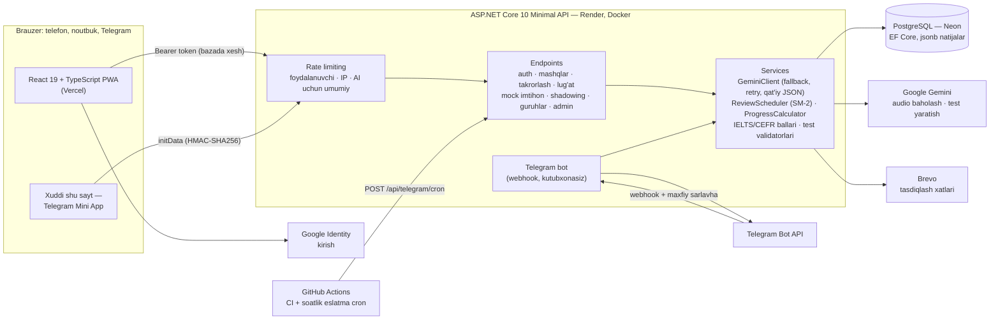

# AI Speaking Coach

🇬🇧 [English](README.md) · 🇺🇿 O'zbekcha

IELTS, milliy CEFR (Multilevel) imtihoniga yoki shunchaki kundalik ingliz tiliga tayyorlanayotgan o'zbek va rus tilli o'quvchilar (A2–C1) uchun ilova. Siz **gapirasiz, yozasiz, o'qiysiz va tinglaysiz**. Sun'iy intellekt (Google Gemini) har bir urinishni rubrika bo'yicha baholab, aniq xatolarni ko'rsatadi. **Har bir xato esa kartaga aylanadi** va uni unutish arafasida qaytadan ko'rasiz. O'quv materiallari **ilovaning o'zida**: mashqlar, to'liq mock testlar, mavzular, grammatika darslari va mavzuli lug'at. Sun'iy intellekt yangi material faqat foydalanuvchi so'raganda yozadi. Interfeys o'zbek, rus va ingliz tillarida; telefonda, noutbukda va Telegram ichida ishlaydi.

**[Ilovani ochish](https://speaking-coach-theta.vercel.app)** · **[▶ Demo — ro'yxatdan o'tmasdan](https://speaking-coach-theta.vercel.app/#/demo)** · **[Case study: loyiha qanday qurilgan (ingliz tilida)](docs/case-study.md)**

Demo tayyor bir haftalik tarix, kartalar va seriyasi bor shaxsiy hisob ochadi; u 24 soatdan keyin o'chiriladi. Server bepul tarifda ishlaydi va bo'sh turganda "uxlaydi", shuning uchun birinchi so'rov 30–60 soniya olishi mumkin.

### Noutbukda

Ekran to'liq ishlatiladi: chapda menyu, sahifalar ikki ustunda. Mock imtihonda esa matn va savollar yonma-yon turadi, xuddi kompyuterda topshiriladigan IELTS'dagidek.

| Bosh sahifa | IELTS Reading: matn va savollar yonma-yon |
|---|---|
|  |  |
| **IELTS Writing: topshiriq va javob yonma-yon** | **Shadowing: chapda qahramonlar, o'ngda gaplar** |
|  |  |

### Telefonda

| Bugungi reja | Takrorlash | Yozish natijasi | Tungi rejim |
|---|---|---|---|
|  |  |  |  |

| IELTS Reading mock | To'liq mock natijasi | CEFR Listening (xarita) | O'qituvchi: natijalar |
|---|---|---|---|
|  |  |  |  |

| Shadowing | Shadowing: AI tekshiruvi | Natijalar va daraja | Lug'at |
|---|---|---|---|
|  |  |  |  |

Skrinshotlarni Playwright end-to-end testlari soxta API bilan oladi, shuning uchun ular doim hozirgi interfeysni ko'rsatadi.

## Ilova nima qiladi

| | |
|---|---|
| 🎙 **Gapirish** | Mavzu bo'yicha javobingizni yozib olasiz. Gemini bitta so'rovda ovozni matnga aylantiradi va ravonlik, grammatika, so'z boyligini baholaydi. |
| ✍️ **Yozish** | Insho yozasiz. U IELTS uslubidagi rubrika (vazifa, bog'liqlik, grammatika, lug'at) bo'yicha baholanadi va aniq tuzatishlar beriladi. |
| 📖 🎧 **O'qish va tinglash** | Matn (yoki brauzer ovoz chiqarib o'qiydigan nutq) va to'rtta savol. Foydalanuvchi o'zi tanlaydi: **📚 tayyor mashq** — ilovadagi 40 ta original matndan (A2–C1, cheksiz) yoki **✨ AI yozgan yangi mashq** (kunlik limit bilan). Javoblarni server tekshiradi, to'g'ri javoblar brauzerga umuman bormaydi. Matndagi istalgan so'zni bossangiz, ma'nosi aynan shu gap ichida tushuntiriladi. |
| 🔁 **Takrorlash** | Tuzatishlar va xato javoblar kartaga aylanadi va SM-2 algoritmi bo'yicha qaytadi. Kunlik maqsad, seriya (🔥) va quloqchin bilan qo'l tegizmasdan ishlaydigan **yo'lda rejimi** bor. |
| 📚 **Lug'at** | Saqlangan so'zlar: qidirish, *Yangi / O'rganilmoqda / Yodlangan* filtri va tezkor viktorina. Har kuni bitta yangi so'z, hamma uchun bir xil. |
| 🎓 **Mock imtihonlar** | **IELTS**: Listening, Reading, Writing, Speaking va rasmiy yaxlitlash qoidasi bilan to'liq imtihon. **CEFR Multilevel**: to'rtala bo'lim rasmiy format va baholash jadvallari asosida. Ilova bilan birga to'liq original Listening va Reading testlari hamda 50 ta Speaking/Writing variantlari keladi. Foydalanuvchi hali ishlamagan testni oladi; bank tugasa, o'zi tanlaydi: birini qayta ishlaydi yoki AI yangi test tuzadi — u qat'iy tekshirilib, umumiy bankka qo'shiladi. Speaking va Writing'ni AI rasmiy mezonlar bo'yicha baholaydi. Har bir ball "taxminiy" deb belgilangan. |
| 🎬 **Shadowing** | Gapni eshitasiz va darhol takrorlaysiz. Ikki seriya bor: karaoke taglavhali YouTube videolari va ilovaning o'z multfilm qahramonlari gapiradigan suhbatlar. Oddiy, avto va qo'l tegizmasdan rejimlari, tezlik va takror, tarjima hamda ixtiyoriy AI talaffuz tekshiruvi mavjud. |
| 📘 **Darslar** | 16 ta grammatika darsi (A2–C1): qoida, misollar, o'zbek va rus tilida so'zlashuvchilarning tipik xatolari va 6 ta savolli mashq — tushuntirishlar uch tilda; xohlasangiz, AI yana 6 ta savol tuzadi. 12 ta mavzuli lug'at (196 so'z: tarjima, ta'rif, misol, talaffuz), o'zini tekshirish testi va bir bosishda lug'atga qo'shish. |
| 🗂 **Mavzular** | Speaking va Writing uchun daraja va tur bo'yicha 92 ta tayyor mavzu (kundalik, IELTS 1–3-qism, CEFR, xatboshi, insho, xat), tavsiya etilgan so'z soni bilan; **✨ AI mavzu** tugmasi yangisini taklif qiladi. |
| 🧭 **Bugungi reja** | Qisqa tanishtiruvda maqsad, daraja, maqsad ball, imtihon sanasi va kunlik vaqt so'raladi. Shundan har kunlik reja tuziladi: bajarilgani o'zi belgilanadi, imtihongacha qolgan kunlar ko'rinib turadi. |
| 👩‍🏫 **O'qituvchi guruhlari** | O'qituvchi taklif kodini ulashadi, vazifa beradi (mashq, mock bo'limi, "N ta karta takrorlash") va muddat qo'yadi. Natijalarni jadvalda ko'radi. Vazifa alohida topshirilmaydi: o'quvchi mashqni bajarsa, o'zi belgilanadi. |
| 📈 **Natijalar** | XP, darajalar, nishonlar, faollik kalendari va ballar grafigi. Taxallus bilan ixtiyoriy haftalik musobaqa ham bor. |
| 📲 **Telegram bot** | [@SpeakingCoachUzBot](https://t.me/SpeakingCoachUzBot): kartalarni chatning o'zida takrorlash, so'z yuborib tarjimasini olish va lug'atga qo'shish, kuniga bitta eslatma, bugungi reja va vazifalar. Sayt Telegram ichida Mini App bo'lib ochiladi va ulangan foydalanuvchini parolsiz kiritadi. O'qituvchilar PDF, rasm yoki mavzudan qat'iy tekshirilgan mock test tayyorlaydi, admin esa uni tasdiqlaydi. |
| 👀 **Demo hisob** | Bir bosishda tayyor ma'lumotli shaxsiy vaqtinchalik hisob ochiladi. Istalgan odam ro'yxatdan o'tmasdan barcha sahifalarni ko'ra oladi. |
| 🔐 **Hisob** | Email va 6 xonali tasdiqlash kodi, parolni tiklash yoki Google orqali kirish. Hammasi mehmon sifatida ham ishlaydi, faqat hech narsa saqlanmaydi. Ma'lumotlaringizni profildan yuklab olish yoki butunlay o'chirish mumkin. |
| 🌐 **Uch til** | Interfeys, server xabarlari va so'z tarjimalari o'zbek, rus va ingliz tillarida. |

## Qanday qurilgan

```mermaid
flowchart LR
    subgraph Client["Brauzer: telefon, noutbuk, Telegram"]
        SPA["React 19 + TypeScript PWA<br/>(Vercel)"]
        MINI["Xuddi shu sayt —<br/>Telegram Mini App"]
    end

    subgraph API["ASP.NET Core 10 Minimal API — Render, Docker"]
        RL["Rate limiting<br/>foydalanuvchi · IP · AI uchun umumiy"]
        EP["Endpoints<br/>auth · mashqlar · takrorlash · lug'at<br/>mock imtihon · shadowing · guruhlar · admin"]
        SVC["Services<br/>GeminiClient (fallback, retry, qat'iy JSON)<br/>ReviewScheduler (SM-2) · ProgressCalculator<br/>IELTS/CEFR ballari · test validatorlari"]
        BOT["Telegram bot<br/>(webhook, kutubxonasiz)"]
    end

    DB[("PostgreSQL — Neon<br/>EF Core, jsonb natijalar")]
    GEM["Google Gemini<br/>audio baholash · test yaratish"]
    TG["Telegram Bot API"]
    BREVO["Brevo<br/>tasdiqlash xatlari"]
    GOOGLE["Google Identity<br/>kirish"]
    GH["GitHub Actions<br/>CI + soatlik eslatma cron"]

    SPA -- "Bearer token (bazada xesh)" --> RL --> EP
    MINI -- "initData (HMAC-SHA256)" --> RL
    EP --> SVC --> DB
    SVC --> GEM
    TG -- "webhook + maxfiy sarlavha" --> BOT --> SVC
    BOT --> TG
    SVC --> BREVO
    SPA --> GOOGLE
    GH -- "POST /api/telegram/cron" --> EP
```

**Bitta so'rov boshidan oxirigacha (Speaking).** Brauzer ovozni yozadi → `POST /api/speaking/submit` → rate limiter → kunlik AI limiti tekshiriladi → Gemini bitta so'rovda matn va ballarni qaytaradi → JSON qat'iy o'qiladi va ballar chegarasi tekshiriladi → urinish `Activities` ga yoziladi, har bir tuzatish shu tranzaksiyaning o'zida kartaga aylanadi → limit faqat muvaffaqiyatli javobdan keyin hisoblanadi.

| Qatlam | Texnologiya |
|---|---|
| Frontend | React 19, TypeScript, Vite, Vitest; CSS o'zgaruvchilaridan iborat kichik dizayn tizimi (UI freymvorksiz); PWA; hash marshrutlash; Vercel |
| Backend | ASP.NET Core 10 Minimal API, EF Core + Npgsql, o'rnatilgan rate limiter; Render'da Docker |
| Baza | Neon'dagi PostgreSQL; barcha mashq turlari uchun bitta `Activities` jadvali, natijalar `jsonb` da |
| AI | Google Gemini (ovoz va matn kiradi, qat'iy JSON chiqadi), zaxira model bilan |
| Nutq | Brauzerning Web Speech API'si: tinglash matnlari va qahramonlar ovozi |
| Xabarlar | Telegram Bot API (webhook), email uchun Brevo HTTPS API |
| CI | GitHub Actions: build, testlar, zaif paketlarni tekshirish; Dependabot |

Hammasi bepul tariflarda ishlaydi.

## Muhandislik qarorlari

- **Speaking uchun bitta Gemini so'rovi.** Gemini ovozni to'g'ridan-to'g'ri qabul qiladi, shuning uchun alohida "nutqni matnga aylantirish" xizmati kerak emas. So'rovlar ikki baravar kam, buziladigan qism ham bittaga kam.
- **Model javobi — ishonchsiz ma'lumot.** Javoblar `RespectRequiredConstructorParameters` va `RespectNullableAnnotations` bilan o'qiladi, keyin ballar chegarasi tekshiriladi. Odatiy `System.Text.Json` yo'q `score` maydonini jimgina `0` qilib saqlab qo'yardi. Loyihada shu xato haqiqatan chiqqan va ildizidan tuzatilgan.
- **Avval ilovaning o'z materiali, AI — so'ralganda.** Mashq qilish uchun kerak bo'lgan hamma narsa ilovaning ichida: darhol ochiladi, pul turmaydi va AI limiti tugaganda ham ishlayveradi. Material ikkala manbadan kelishi mumkin bo'lgan joyda foydalanuvchi tanlaydi: "📚 tayyor" yoki "✨ AI yangisini yozsin". Tayyor materiallar ham AI javobi bilan bir xil qat'iy validatorlardan o'tadi (darajaga mos so'z soni, savol formatlari, javob matnda borligi) — buni unit testlar kafolatlaydi.
- **Testni model yozadi, kod baholaydi.** To'g'ri javobi ma'lum joyda baholashni C# kodi qiladi. Mock testlar bir marta yaratiladi va qat'iy validatorlardan o'tadi: raqamlash, javob turlari, bo'sh joy javobi matnda borligi, xarita variantlari. Keyin umumiy bankdan qayta ishlatiladi. AI limiti faqat bank tugaganda sarflanadi.
- **Baholash barqarorligi o'lchanadi.** Ichki test bir xil yozuv yoki inshoni besh marta qayta baholaydi va har bir mezon bo'yicha tarqoqlikni ko'rsatadi. Shunda AI baholovchining noaniqligi ko'zga ko'rinadi.
- **Uxlaydigan serverga moslangan.** Bot webhook bilan ishlaydi: kelgan xabar serverni uyg'otadi. Eslatmalarni GitHub Actions har soatda ishga tushiradi. Har bir hisob xabar yuborilishidan oldin atomar "band qilinadi", shuning uchun kechikkan yoki takrorlangan cron ikki marta yozmaydi.
- **Asosiy mantiq sof funksiyalarda.** SM-2, IELTS ballini yaxlitlash, CEFR jadvallari, XP va nishonlar, eslatma vaqti va demo ma'lumotlari bazaga ham, HTTP'ga ham tegmaydi. 533 ta test bir necha soniyada o'tishining sababi shu.
- **XP saqlanmaydi, hisoblanadi.** Daraja, nishon va musobaqa tarixdan hisoblanadi. Shuning uchun hech narsa "sinxrondan chiqmaydi", qoida o'zgarsa eski natijalar ham o'zi qayta hisoblanadi.
- **Kutubxonasiz, tipga qat'iy tarjimalar.** Har bir sahifa matnlarini bir marta o'zbekcha yozadi, rus va ingliz variantlari esa aynan shu shaklda bo'lishi shart. Bitta tarjima tushib qolsa, build yiqiladi.
- **Bitta dizayn, uch xil ekran.** Asosiy loyiha telefon uchun, menyu pastda. Planshetda menyu tepaga chiqadi. Noutbukda chap menyu, ikki ustunli sahifalar va yonma-yon imtihon paydo bo'ladi, klaviatura tugmalari ham ishlaydi: Probel — javob yoki tinglash, 1–4 — baho, ← → — gaplar orasida yurish, R — yozish.

## Xavfsizlik va ishonchlilik

- **Hisoblar.** Email egaligi 6 xonali kod bilan isbotlanadi. Kod xesh ko'rinishida saqlanadi, 15 daqiqa amal qiladi, 5 ta urinish bazada atomar hisoblanadi, qayta yuborishda kutish vaqti bor. Tasdiqlanmagan hisobga parol faqat kod tasdiqlangach yoziladi, shuning uchun birovning emailini oldindan "egallab" bo'lmaydi. Google tokeni serverda Google kalitlari bilan tekshiriladi. Sessiya — tasodifiy token, bazada faqat SHA-256 xeshi saqlanadi, shuning uchun "Chiqish" uni darhol bekor qiladi.
- **Suiiste'moldan himoya.** Kirishga IP bo'yicha cheklov qo'yilgan. AI endpoint'larida: foydalanuvchiga daqiqasiga 30 ta, bir vaqtda 2 ta; bitta IP'ga 8 ta, butun serverga 16 ta. Har bir hisobning kunlik AI limiti bor (mehmon va demo hisobga kamroq), u faqat muvaffaqiyatli javobdan keyin kamayadi. Test yaratish foydalanuvchiga bir vaqtda bittadan, muvaffaqiyatsiz urinishlar ham sanaladi.
- **Telegram.** Webhook maxfiy sarlavha bilan tekshiriladi. Mini App orqali kirishda Telegram'ning HMAC imzosi tekshiriladi va u faqat haqiqiy Telegram ichida hamda 1 soatdan eski bo'lmasa qabul qilinadi. Bot adminlari faqat raqamli ID bo'yicha aniqlanadi, username bo'yicha emas.
- **Maxfiy ma'lumotlar.** Gemini kaliti URL'da emas, sarlavhada yuboriladi. Speaking audiosi diskka yozilmaydi. Docker obrazi root'siz ishlaydi. Sayt `nosniff`, qat'iy Referrer-Policy, faqat mikrofonga ruxsat va faqat Telegram'ga iframe ruxsati (`frame-ancestors`) sarlavhalarini yuboradi. Musobaqa ixtiyoriy, admin panelda faqat umumiy sonlar va yashirilgan emaillar ko'rinadi.
- **Barqarorlik.** Bazadagi vaqtinchalik xatolarda so'rov qayta bajariladi. Eskirgan sessiya, kod va demo hisoblar har soatda tozalanadi. Brauzerda sahifa xatosi yoki deploydan keyin yuklanmagan bo'lak oq ekran emas, "Qayta yuklash" kartasini ko'rsatadi. Server sekin uyg'onsa ham foydalanuvchi hisobdan chiqib ketmaydi.

## Sifat

- **Backend'da 533 ta unit test** (xUnit). Ular takrorlash jadvali, baholash jadvallari, validatorlar, qat'iy o'qish, xavfsizlik qoidalari, bot mantiqi, tarjimalar (har bir xabar uch tilda, bir xil parametrlar bilan), demo ma'lumotlari va ilovadagi har bir tayyor materialni (mock testlar, mashqlar) tekshiradi.
- **Frontend'da 121 ta unit test** (Vitest): grafiklar, matn bilan ishlash, shadowing mantiqi, Telegram'dan ochilishni tekshirish va ilovadagi darslar, lug'at va mavzular.
- **24 ta Playwright end-to-end to'plami** haqiqiy frontend'ni soxta API bilan telefon, planshet va noutbuk ekranlarida sinaydi. Yuqoridagi skrinshotlar ham shu testlardan olingan.
- **CI** har bir push'da ikkala qismni build qilib testlaydi, ma'lum zaifligi bor paket bo'lsa yiqiladi.

## Cheklovlar va keyingi qadamlar

- Baza va endpoint qatlami uchun integration testlar hali yo'q. Keyingi qadam — `WebApplicationFactory` va Testcontainers'dagi haqiqiy Postgres.
- Bepul tarif sabab birinchi ochilish 30–60 soniya olishi mumkin, Gemini limiti esa hamma uchun umumiy.
- Sayt va API turli domenlarda bo'lgani uchun token `localStorage` da saqlanadi. O'z domeni bo'lsa, `httpOnly` cookie va tasdiqlangan email yuboruvchi ishlatish mumkin bo'ladi.
- Ballar taxminiy. Rasmiy IELTS va CEFR natijasini faqat sertifikatlangan imtihon markazi beradi.

Loyiha qanday qurilgani, yo'lda nimalar buzilgani va qanday tuzatilgani **[case study](docs/case-study.md)** da batafsil yozilgan.
